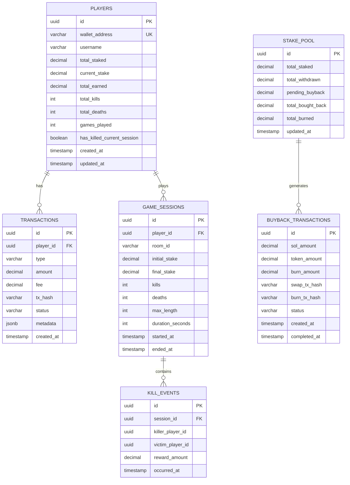

# Backend Design - Solana Integration

## 1. Database Schema Details

### 1.1 Entity Relationship Diagram



### 1.2 Additional Tables

#### **kill_events**
```sql
CREATE TABLE kill_events (
    id UUID PRIMARY KEY DEFAULT gen_random_uuid(),
    session_id UUID REFERENCES game_sessions(id),
    killer_player_id UUID REFERENCES players(id),
    victim_player_id UUID REFERENCES players(id),
    killer_stake_before DECIMAL(18, 9),
    killer_stake_after DECIMAL(18, 9),
    victim_stake_before DECIMAL(18, 9),
    reward_amount DECIMAL(18, 9),
    buyback_amount DECIMAL(18, 9),
    occurred_at TIMESTAMP DEFAULT NOW()
);

CREATE INDEX idx_kill_events_session ON kill_events(session_id);
CREATE INDEX idx_kill_events_killer ON kill_events(killer_player_id);
CREATE INDEX idx_kill_events_victim ON kill_events(victim_player_id);
```

#### **wallet_verifications**
```sql
CREATE TABLE wallet_verifications (
    id UUID PRIMARY KEY DEFAULT gen_random_uuid(),
    wallet_address VARCHAR(44) UNIQUE NOT NULL,
    nonce VARCHAR(64) NOT NULL,
    signature VARCHAR(128),
    verified BOOLEAN DEFAULT FALSE,
    expires_at TIMESTAMP NOT NULL,
    created_at TIMESTAMP DEFAULT NOW()
);

CREATE INDEX idx_wallet_verifications_address ON wallet_verifications(wallet_address);
```

## 2. API Design

### 2.1 Wallet Endpoints

#### **POST /api/wallet/request-verification**
Request a nonce for wallet verification.

**Request:**
```json
{
  "walletAddress": "7xKXtg2CW87d97TXJSDpbD5jBkheTqA83TZRuJosgAsU"
}
```

**Response:**
```json
{
  "nonce": "abc123xyz456",
  "message": "Sign this message to verify your wallet: abc123xyz456",
  "expiresAt": "2025-01-07T12:00:00Z"
}
```

#### **POST /api/wallet/verify**
Verify wallet signature.

**Request:**
```json
{
  "walletAddress": "7xKXtg2CW87d97TXJSDpbD5jBkheTqA83TZRuJosgAsU",
  "signature": "base58_encoded_signature",
  "nonce": "abc123xyz456"
}
```

**Response:**
```json
{
  "verified": true,
  "token": "jwt_token_here",
  "player": {
    "id": "uuid",
    "walletAddress": "7xKXtg2CW87d97TXJSDpbD5jBkheTqA83TZRuJosgAsU",
    "username": "Player_abc1",
    "currentStake": "0",
    "totalEarned": "1.5"
  }
}
```

#### **GET /api/wallet/balance/:address**
Get wallet balance and game stats.

**Response:**
```json
{
  "walletAddress": "7xKXtg2CW87d97TXJSDpbD5jBkheTqA83TZRuJosgAsU",
  "solBalance": "10.5",
  "currentStake": "0.5",
  "totalEarned": "2.3",
  "totalKills": 15,
  "totalDeaths": 8,
  "gamesPlayed": 23
}
```

### 2.2 Stake Endpoints

#### **POST /api/stake/deposit**
Deposit stake to join game.

**Request:**
```json
{
  "walletAddress": "7xKXtg2CW87d97TXJSDpbD5jBkheTqA83TZRuJosgAsU",
  "amount": "0.5",
  "txHash": "5j7s8K9mN2pQ3rT4vW6xY8zA1bC2dE3fG4hI5jK6lM7nO8pQ9rS0tU1vW2xY3z"
}
```

**Response:**
```json
{
  "success": true,
  "transactionId": "uuid",
  "stakeAmount": "0.5",
  "snakeSize": 15,
  "roomToken": "room_token_for_colyseus"
}
```

**Error Response:**
```json
{
  "success": false,
  "error": "INSUFFICIENT_AMOUNT",
  "message": "Minimum stake is 0.1 SOL",
  "minStake": "0.1"
}
```

#### **GET /api/stake/calculate-size**
Calculate snake size based on stake amount.

**Query Parameters:**
- `amount`: Stake amount in SOL

**Response:**
```json
{
  "stakeAmount": "0.5",
  "snakeSize": 15,
  "speed": 3.5,
  "formula": "size = 5 + (amount * 20)"
}
```

#### **GET /api/stake/verify/:txHash**
Verify a stake transaction on blockchain.

**Response:**
```json
{
  "verified": true,
  "amount": "0.5",
  "from": "user_wallet_address",
  "to": "stake_pool_address",
  "blockTime": 1704628800,
  "confirmations": 32
}
```

### 2.3 Withdraw Endpoints

#### **GET /api/withdraw/calculate**
Calculate withdraw amount with fees.

**Headers:**
```
Authorization: Bearer jwt_token
```

**Response:**
```json
{
  "currentStake": "1.5",
  "hasKilled": true,
  "feePercentage": 0,
  "feeAmount": "0",
  "netAmount": "1.5",
  "warning": null
}
```

**Response (No Kills):**
```json
{
  "currentStake": "0.5",
  "hasKilled": false,
  "feePercentage": 10,
  "feeAmount": "0.05",
  "netAmount": "0.45",
  "warning": "You will lose 10% (0.05 SOL) as you haven't killed anyone yet."
}
```

#### **POST /api/withdraw/request**
Request withdrawal from game.

**Request:**
```json
{
  "confirm": true
}
```

**Response:**
```json
{
  "success": true,
  "transactionId": "uuid",
  "withdrawAmount": "1.45",
  "feeAmount": "0.05",
  "netAmount": "1.4",
  "txHash": "blockchain_tx_hash",
  "status": "PENDING"
}
```

#### **GET /api/withdraw/status/:transactionId**
Check withdrawal status.

**Response:**
```json
{
  "transactionId": "uuid",
  "status": "CONFIRMED",
  "amount": "1.4",
  "txHash": "blockchain_tx_hash",
  "confirmations": 32,
  "createdAt": "2025-01-07T10:00:00Z",
  "confirmedAt": "2025-01-07T10:00:32Z"
}
```

### 2.4 Game Endpoints

#### **POST /api/game/join**
Join game room with verified stake.

**Request:**
```json
{
  "roomId": "snake_game_room_1",
  "playerName": "CryptoSnake",
  "skinId": 3
}
```

**Response:**
```json
{
  "success": true,
  "roomId": "snake_game_room_1",
  "sessionToken": "colyseus_session_token",
  "playerConfig": {
    "id": "session_id",
    "stake": "0.5",
    "size": 15,
    "color": "#F3FF33"
  }
}
```

#### **POST /api/game/leave**
Leave game and finalize session.

**Request:**
```json
{
  "roomId": "snake_game_room_1",
  "sessionId": "player_session_id"
}
```

**Response:**
```json
{
  "success": true,
  "sessionSummary": {
    "duration": 1800,
    "kills": 3,
    "deaths": 1,
    "startStake": "0.5",
    "endStake": "0.8",
    "earnings": "0.3"
  }
}
```

### 2.5 Token & Buyback Endpoints

#### **GET /api/token/stats**
Get token and buyback statistics.

**Response:**
```json
{
  "tokenMint": "token_mint_address",
  "currentPrice": "0.05",
  "totalBurned": "15000",
  "pendingBuyback": "2.5",
  "totalBoughtBack": "50.5",
  "lastBuybackAt": "2025-01-07T09:00:00Z",
  "nextBuybackThreshold": "1.0"
}
```

#### **POST /api/token/trigger-buyback** (Admin only)
Manually trigger token buyback.

**Request:**
```json
{
  "amount": "2.5"
}
```

**Response:**
```json
{
  "success": true,
  "jobId": "buyback_job_uuid",
  "solAmount": "2.5",
  "status": "QUEUED"
}
```

#### **GET /api/token/buyback-history**
Get buyback transaction history.

**Query Parameters:**
- `limit`: Number of records (default: 20)
- `offset`: Pagination offset (default: 0)

**Response:**
```json
{
  "transactions": [
    {
      "id": "uuid",
      "solAmount": "2.5",
      "tokenAmount": "50",
      "burnAmount": "50",
      "swapTxHash": "swap_tx_hash",
      "burnTxHash": "burn_tx_hash",
      "status": "COMPLETED",
      "createdAt": "2025-01-07T09:00:00Z",
      "completedAt": "2025-01-07T09:01:30Z"
    }
  ],
  "total": 150,
  "limit": 20,
  "offset": 0
}
```

### 2.6 Leaderboard Endpoints

#### **GET /api/leaderboard/top-earners**
Get top earning players.

**Query Parameters:**
- `limit`: Number of players (default: 10)
- `period`: 'all', 'daily', 'weekly', 'monthly'

**Response:**
```json
{
  "period": "all",
  "leaderboard": [
    {
      "rank": 1,
      "walletAddress": "7xKX...gAsU",
      "username": "SnakeKing",
      "totalEarned": "15.5",
      "totalKills": 50,
      "gamesPlayed": 100
    }
  ]
}
```

## 3. Service Layer Design

### 3.1 SolanaService

```typescript
// server/src/services/SolanaService.ts

import { Connection, PublicKey, Transaction, Keypair } from '@solana/web3.js';

export class SolanaService {
  private connection: Connection;
  private stakePoolAddress: PublicKey;
  private feePayerKeypair: Keypair;

  constructor() {
    this.connection = new Connection(
      process.env.SOLANA_RPC_URL!,
      'confirmed'
    );
    this.stakePoolAddress = new PublicKey(
      process.env.SOLANA_STAKE_POOL_ADDRESS!
    );
    // Load fee payer from env (secure!)
    this.feePayerKeypair = Keypair.fromSecretKey(
      Buffer.from(process.env.SOLANA_FEE_PAYER_PRIVATE_KEY!, 'base64')
    );
  }

  /**
   * Verify a transaction exists and is confirmed
   */
  async verifyTransaction(txHash: string): Promise<{
    verified: boolean;
    amount: number;
    from: string;
    to: string;
  }> {
    // Implementation
  }

  /**
   * Check if a deposit transaction is valid
   */
  async verifyDepositTransaction(
    txHash: string,
    expectedAmount: number,
    userWallet: string
  ): Promise<boolean> {
    // Implementation
  }

  /**
   * Send SOL to a wallet
   */
  async sendSol(
    toAddress: string,
    amount: number
  ): Promise<string> {
    // Implementation: Create transaction, sign, send
  }

  /**
   * Get wallet balance
   */
  async getBalance(walletAddress: string): Promise<number> {
    const publicKey = new PublicKey(walletAddress);
    const balance = await this.connection.getBalance(publicKey);
    return balance / 1e9; // Convert lamports to SOL
  }

  /**
   * Get stake pool balance
   */
  async getStakePoolBalance(): Promise<number> {
    return this.getBalance(this.stakePoolAddress.toBase58());
  }
}
```

### 3.2 StakeService

```typescript
// server/src/services/StakeService.ts

import { SolanaService } from './SolanaService';
import { PlayerRepository } from '../repositories/PlayerRepository';
import { TransactionRepository } from '../repositories/TransactionRepository';

export class StakeService {
  constructor(
    private solanaService: SolanaService,
    private playerRepo: PlayerRepository,
    private transactionRepo: TransactionRepository
  ) {}

  /**
   * Process stake deposit
   */
  async processDeposit(
    walletAddress: string,
    amount: number,
    txHash: string
  ): Promise<{
    success: boolean;
    transactionId?: string;
    snakeSize?: number;
    error?: string;
  }> {
    // 1. Validate amount
    if (amount < parseFloat(process.env.MIN_STAKE_AMOUNT!)) {
      return {
        success: false,
        error: 'INSUFFICIENT_AMOUNT'
      };
    }

    // 2. Verify transaction on blockchain
    const verified = await this.solanaService.verifyDepositTransaction(
      txHash,
      amount,
      walletAddress
    );

    if (!verified) {
      return {
        success: false,
        error: 'INVALID_TRANSACTION'
      };
    }

    // 3. Check if transaction already processed
    const existingTx = await this.transactionRepo.findByTxHash(txHash);
    if (existingTx) {
      return {
        success: false,
        error: 'TRANSACTION_ALREADY_PROCESSED'
      };
    }

    // 4. Create or update player
    let player = await this.playerRepo.findByWallet(walletAddress);
    if (!player) {
      player = await this.playerRepo.create({
        walletAddress,
        username: `Player_${walletAddress.slice(0, 4)}`
      });
    }

    // 5. Record transaction
    const transaction = await this.transactionRepo.create({
      playerId: player.id,
      type: 'STAKE',
      amount,
      fee: 0,
      txHash,
      status: 'CONFIRMED'
    });

    // 6. Update player stake
    await this.playerRepo.update(player.id, {
      currentStake: player.currentStake + amount,
      totalStaked: player.totalStaked + amount
    });

    // 7. Calculate snake size
    const snakeSize = this.calculateSnakeSize(amount);

    return {
      success: true,
      transactionId: transaction.id,
      snakeSize
    };
  }

  /**
   * Calculate snake size based on stake
   * Formula: baseSize + (stakeAmount * multiplier)
   */
  calculateSnakeSize(stakeAmount: number): number {
    const baseSize = 5;
    const multiplier = 20;
    return Math.floor(baseSize + (stakeAmount * multiplier));
  }

  /**
   * Calculate withdraw amount with fees
   */
  async calculateWithdraw(playerId: string): Promise<{
    currentStake: number;
    hasKilled: boolean;
    feePercentage: number;
    feeAmount: number;
    netAmount: number;
  }> {
    const player = await this.playerRepo.findById(playerId);
    
    const feePercentage = player.hasKilledCurrentSession ? 0 : 10;
    const feeAmount = (player.currentStake * feePercentage) / 100;
    const netAmount = player.currentStake - feeAmount;

    return {
      currentStake: player.currentStake,
      hasKilled: player.hasKilledCurrentSession,
      feePercentage,
      feeAmount,
      netAmount
    };
  }

  /**
   * Process withdrawal
   */
  async processWithdraw(playerId: string): Promise<{
    success: boolean;
    transactionId?: string;
    txHash?: string;
    netAmount?: number;
    error?: string;
  }> {
    const player = await this.playerRepo.findById(playerId);

    if (player.currentStake <= 0) {
      return {
        success: false,
        error: 'NO_STAKE_TO_WITHDRAW'
      };
    }

    // Calculate withdraw
    const { feeAmount, netAmount } = await this.calculateWithdraw(playerId);

    // Send SOL to user
    const txHash = await this.solanaService.sendSol(
      player.walletAddress,
      netAmount
    );

    // Record transaction
    const transaction = await this.transactionRepo.create({
      playerId: player.id,
      type: 'WITHDRAW',
      amount: player.currentStake,
      fee: feeAmount,
      txHash,
      status: 'PENDING'
    });

    // Update player
    await this.playerRepo.update(player.id, {
      currentStake: 0,
      hasKilledCurrentSession: false
    });

    // If there's a fee, add to buyback pool
    if (feeAmount > 0) {
      await this.addToBuybackPool(feeAmount);
    }

    return {
      success: true,
      transactionId: transaction.id,
      txHash,
      netAmount
    };
  }

  /**
   * Add amount to buyback pool
   */
  private async addToBuybackPool(amount: number): Promise<void> {
    // Implementation: Update stake_pool table
  }
}
```

### 3.3 TokenService

```typescript
// server/src/services/TokenService.ts

import axios from 'axios';
import { SolanaService } from './SolanaService';

export class TokenService {
  constructor(private solanaService: SolanaService) {}

  /**
   * Execute token buyback using Jupiter Aggregator
   */
  async executeBuyback(solAmount: number): Promise<{
    success: boolean;
    tokenAmount?: number;
    swapTxHash?: string;
    error?: string;
  }> {
    try {
      // 1. Get quote from Jupiter
      const quote = await this.getJupiterQuote(solAmount);
      
      // 2. Execute swap
      const swapTxHash = await this.executeSwap(quote);
      
      // 3. Get token amount received
      const tokenAmount = await this.getTokenAmountFromTx(swapTxHash);
      
      return {
        success: true,
        tokenAmount,
        swapTxHash
      };
    } catch (error) {
      return {
        success: false,
        error: error.message
      };
    }
  }

  /**
   * Burn tokens
   */
  async burnTokens(amount: number): Promise<{
    success: boolean;
    burnTxHash?: string;
    error?: string;
  }> {
    // Implementation: Send tokens to burn address or use token program burn
  }

  /**
   * Get quote from Jupiter
   */
  private async getJupiterQuote(solAmount: number): Promise<any> {
    const response = await axios.get(
      `${process.env.DEX_API_URL}/quote`,
      {
        params: {
          inputMint: 'So11111111111111111111111111111111111111112', // SOL
          outputMint: process.env.SOLANA_PROJECT_TOKEN_MINT,
          amount: solAmount * 1e9, // Convert to lamports
          slippageBps: 50 // 0.5% slippage
        }
      }
    );
    return response.data;
  }

  /**
   * Execute swap transaction
   */
  private async executeSwap(quote: any): Promise<string> {
    // Implementation: Create and send swap transaction
  }

  /**
   * Get token amount from transaction
   */
  private async getTokenAmountFromTx(txHash: string): Promise<number> {
    // Implementation: Parse transaction to get token amount
  }
}
```

### 3.4 WalletService

```typescript
// server/src/services/WalletService.ts

import * as nacl from 'tweetnacl';
import * as bs58 from 'bs58';
import { generateNonce } from '../utils/crypto.utils';

export class WalletService {
  /**
   * Generate verification nonce
   */
  async requestVerification(walletAddress: string): Promise<{
    nonce: string;
    message: string;
    expiresAt: Date;
  }> {
    const nonce = generateNonce();
    const expiresAt = new Date(Date.now() + 5 * 60 * 1000); // 5 minutes

    // Store in database
    await this.storeNonce(walletAddress, nonce, expiresAt);

    return {
      nonce,
      message: `Sign this message to verify your wallet: ${nonce}`,
      expiresAt
    };
  }

  /**
   * Verify wallet signature
   */
  async verifySignature(
    walletAddress: string,
    signature: string,
    nonce: string
  ): Promise<boolean> {
    try {
      // 1. Get stored nonce
      const storedNonce = await this.getNonce(walletAddress);
      
      if (!storedNonce || storedNonce.nonce !== nonce) {
        return false;
      }

      if (storedNonce.expiresAt < new Date()) {
        return false;
      }

      // 2. Verify signature
      const message = `Sign this message to verify your wallet: ${nonce}`;
      const messageBytes = new TextEncoder().encode(message);
      const signatureBytes = bs58.decode(signature);
      const publicKeyBytes = bs58.decode(walletAddress);

      const verified = nacl.sign.detached.verify(
        messageBytes,
        signatureBytes,
        publicKeyBytes
      );

      if (verified) {
        // Mark as verified
        await this.markVerified(walletAddress);
      }

      return verified;
    } catch (error) {
      return false;
    }
  }

  private async storeNonce(
    walletAddress: string,
    nonce: string,
    expiresAt: Date
  ): Promise<void> {
    // Implementation: Store in wallet_verifications table
  }

  private async getNonce(walletAddress: string): Promise<any> {
    // Implementation: Get from wallet_verifications table
  }

  private async markVerified(walletAddress: string): Promise<void> {
    // Implementation: Update wallet_verifications table
  }
}
```

## 4. Updated Colyseus Room Schema

### 4.1 SnakeGameState Schema Updates

```typescript
// server/src/rooms/schema/SnakeGameState.ts

import { Schema, type, MapSchema } from "@colyseus/schema";

export class Player extends Schema {
  @type("string") id: string;
  @type("string") name: string;
  @type("string") color: string;
  @type("number") skinId: number;
  @type("number") angle: number = 0;
  @type("number") speed: number = 3;
  @type("boolean") alive: boolean = true;
  @type("number") score: number = 0;
  @type("boolean") boosting: boolean = false;
  @type("number") boostTime: number = 0;
  @type("boolean") invulnerable: boolean = false;
  @type("number") kills: number = 0;
  
  // NEW: Solana-related fields
  @type("string") walletAddress: string = "";
  @type("number") stakeAmount: number = 0;
  @type("boolean") hasKilled: boolean = false;
  
  @type([SnakeSegment]) segments = new ArraySchema<SnakeSegment>();
  @type(Vector2) head = new Vector2();

  // ... existing methods
}

export class SnakeGameState extends Schema {
  @type({ map: Player }) players = new MapSchema<Player>();
  @type({ map: Food }) foods = new MapSchema<Food>();
  
  @type("number") worldWidth: number = 4000;
  @type("number") worldHeight: number = 3000;
  @type("number") maxFoods: number = 100;
  @type("number") tickRate: number = 16;
  @type("boolean") worldBoundaryCollisions: boolean = true;
  
  // NEW: Stake pool info (optional, for display)
  @type("number") totalStaked: number = 0;
  @type("number") totalBurned: number = 0;
}
```

### 4.2 SnakeGameRoom Updates

```typescript
// server/src/rooms/SnakeGameRoom.ts

export class SnakeGameRoom extends Room<SnakeGameState> {
  // ... existing code

  async onJoin(client: Client, options: {
    name: string;
    skinId?: number;
    walletAddress: string;
    stakeAmount: number;
  }) {
    console.log(`${client.sessionId} joined`, options);
    
    // Verify stake before allowing join
    const verified = await this.stakeService.verifyPlayerStake(
      options.walletAddress,
      options.stakeAmount
    );

    if (!verified) {
      throw new Error("Invalid stake");
    }
    
    // Calculate snake size based on stake
    const snakeSize = this.stakeService.calculateSnakeSize(
      options.stakeAmount
    );
    
    const spawnPosition = this.getRandomPosition();
    const skinId = options.skinId !== undefined ? options.skinId : 0;
    const color = this.colors[skinId % this.colors.length];
    
    const player = new Player(
      client.sessionId,
      options.name || `Player ${client.sessionId.substr(0, 4)}`,
      spawnPosition.x,
      spawnPosition.y,
      color
    );
    
    player.skinId = skinId;
    player.walletAddress = options.walletAddress;
    player.stakeAmount = options.stakeAmount;
    player.hasKilled = false;
    
    // Initialize snake with calculated size
    for (let i = 0; i < snakeSize; i++) {
      player.segments.push(
        new SnakeSegment(spawnPosition.x - i * 20, spawnPosition.y)
      );
    }
    
    this.state.players.set(client.sessionId, player);
    
    // Create game session in database
    await this.gameSessionService.createSession({
      playerId: options.walletAddress,
      roomId: this.roomId,
      initialStake: options.stakeAmount
    });
  }

  private async handleKill(killer: Player, victim: Player) {
    // Calculate rewards
    const rewardAmount = (victim.stakeAmount * 90) / 100;
    const buybackAmount = (victim.stakeAmount * 10) / 100;
    
    // Update stakes
    killer.stakeAmount += rewardAmount;
    killer.hasKilled = true;
    killer.kills += 1;
    
    victim.stakeAmount = 0;
    victim.alive = false;
    
    // Process on backend
    await this.stakeService.processKill({
      killerWallet: killer.walletAddress,
      victimWallet: victim.walletAddress,
      rewardAmount,
      buybackAmount
    });
    
    // Broadcast event
    this.broadcast("playerKilled", {
      killer: killer.id,
      victim: victim.id,
      rewardAmount
    });
    
    // Spawn food from dead player
    this.spawnFoodFromDeadPlayer(victim);
  }

  // ... rest of existing code
}
```

## 5. Middleware & Authentication

### 5.1 JWT Authentication Middleware

```typescript
// server/src/api/middlewares/auth.middleware.ts

import { Request, Response, NextFunction } from 'express';
import jwt from 'jsonwebtoken';

export interface AuthRequest extends Request {
  user?: {
    playerId: string;
    walletAddress: string;
  };
}

export const authMiddleware = (
  req: AuthRequest,
  res: Response,
  next: NextFunction
) => {
  const token = req.headers.authorization?.replace('Bearer ', '');

  if (!token) {
    return res.status(401).json({ error: 'No token provided' });
  }

  try {
    const decoded = jwt.verify(token, process.env.JWT_SECRET!) as any;
    req.user = {
      playerId: decoded.playerId,
      walletAddress: decoded.walletAddress
    };
    next();
  } catch (error) {
    return res.status(401).json({ error: 'Invalid token' });
  }
};
```

### 5.2 Rate Limiting Middleware

```typescript
// server/src/api/middlewares/rateLimit.middleware.ts

import rateLimit from 'express-rate-limit';

export const apiLimiter = rateLimit({
  windowMs: 15 * 60 * 1000, // 15 minutes
  max: 100, // Limit each IP to 100 requests per windowMs
  message: 'Too many requests from this IP'
});

export const transactionLimiter = rateLimit({
  windowMs: 60 * 1000, // 1 minute
  max: 5, // Limit to 5 transactions per minute
  message: 'Too many transactions, please try again later'
});
```

## 6. Job Queue for Buyback

### 6.1 Buyback Job

```typescript
// server/src/jobs/BuybackJob.ts

import Queue from 'bull';
import { TokenService } from '../services/TokenService';
import { StakePoolRepository } from '../repositories/StakePoolRepository';

export class BuybackJobProcessor {
  private queue: Queue.Queue;
  
  constructor(
    private tokenService: TokenService,
    private stakePoolRepo: StakePoolRepository
  ) {
    this.queue = new Queue('token-buyback', {
      redis: {
        host: process.env.REDIS_HOST || 'localhost',
        port: parseInt(process.env.REDIS_PORT || '6379')
      }
    });

    this.queue.process(this.processBuyback.bind(this));
  }

  async addToBuybackQueue(amount: number): Promise<void> {
    await this.queue.add({ amount });
  }

  private async processBuyback(job: Queue.Job): Promise<void> {
    const { amount } = job.data;
    
    // Check if we've reached threshold
    const pool = await this.stakePoolRepo.get();
    const totalPending = pool.pendingBuyback + amount;
    
    await this.stakePoolRepo.update({
      pendingBuyback: totalPending
    });
    
    const threshold = parseFloat(process.env.BUYBACK_THRESHOLD || '1.0');
    
    if (totalPending >= threshold) {
      console.log(`Executing buyback for ${totalPending} SOL`);
      
      // Execute buyback
      const result = await this.tokenService.executeBuyback(totalPending);
      
      if (result.success) {
        // Burn tokens
        await this.tokenService.burnTokens(result.tokenAmount!);
        
        // Update pool
        await this.stakePoolRepo.update({
          pendingBuyback: 0,
          totalBoughtBack: pool.totalBoughtBack + totalPending,
          totalBurned: pool.totalBurned + result.tokenAmount!
        });
        
        console.log(`Buyback completed: ${result.tokenAmount} tokens burned`);
      }
    }
  }
}
```

## 7. Error Handling

### 7.1 Custom Error Classes

```typescript
// server/src/utils/errors.ts

export class AppError extends Error {
  constructor(
    public statusCode: number,
    public message: string,
    public code?: string
  ) {
    super(message);
    this.name = this.constructor.name;
    Error.captureStackTrace(this, this.constructor);
  }
}

export class ValidationError extends AppError {
  constructor(message: string, code?: string) {
    super(400, message, code);
  }
}

export class UnauthorizedError extends AppError {
  constructor(message: string = 'Unauthorized', code?: string) {
    super(401, message, code);
  }
}

export class NotFoundError extends AppError {
  constructor(message: string = 'Resource not found', code?: string) {
    super(404, message, code);
  }
}

export class TransactionError extends AppError {
  constructor(message: string, code?: string) {
    super(500, message, code || 'TRANSACTION_ERROR');
  }
}

export class InsufficientFundsError extends AppError {
  constructor(message: string = 'Insufficient funds') {
    super(400, message, 'INSUFFICIENT_FUNDS');
  }
}
```

### 7.2 Global Error Handler

```typescript
// server/src/api/middlewares/errorHandler.middleware.ts

import { Request, Response, NextFunction } from 'express';
import { AppError } from '../../utils/errors';

export const errorHandler = (
  err: Error,
  req: Request,
  res: Response,
  next: NextFunction
) => {
  if (err instanceof AppError) {
    return res.status(err.statusCode).json({
      error: err.code || 'ERROR',
      message: err.message
    });
  }

  // Log unexpected errors
  console.error('Unexpected error:', err);

  return res.status(500).json({
    error: 'INTERNAL_SERVER_ERROR',
    message: 'An unexpected error occurred'
  });
};
```

## 8. Testing Strategy

### 8.1 Unit Tests
- Test each service method independently
- Mock Solana connections
- Test calculation formulas

### 8.2 Integration Tests
- Test API endpoints end-to-end
- Test database transactions
- Test Colyseus room logic

### 8.3 Blockchain Tests
- Test on Solana Devnet first
- Verify transaction confirmations
- Test edge cases (network issues, failed transactions)

---

**Document Version**: 1.0  
**Last Updated**: 2025-01-07

