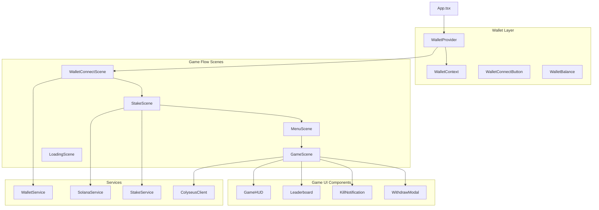
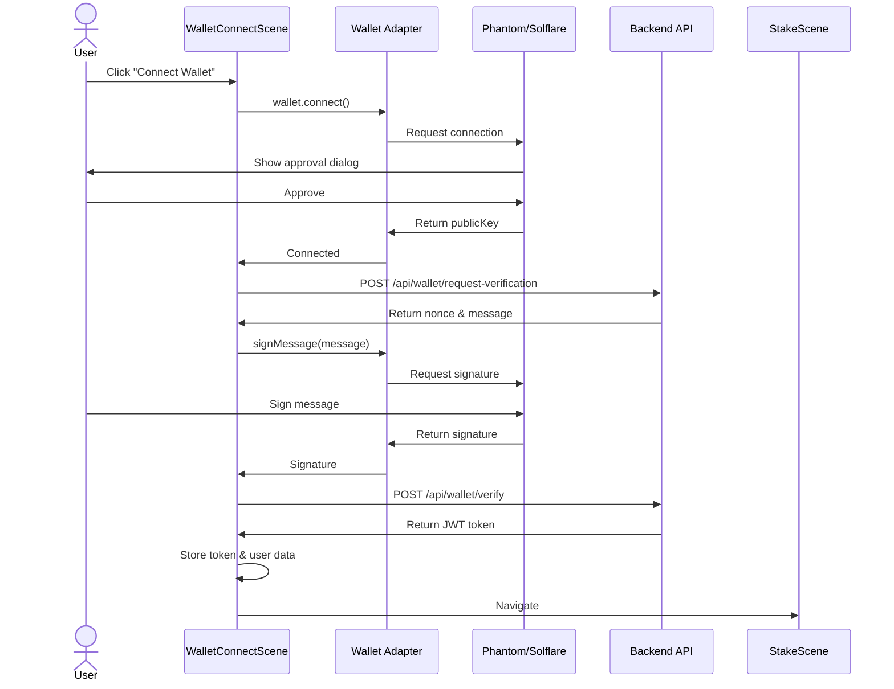
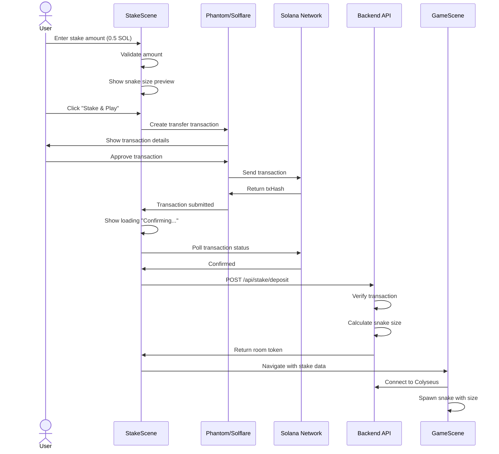

# Frontend Design - Solana Wallet Integration

## 1. Component Architecture



## 2. User Flow Diagrams

### 2.1 Complete User Journey

```mermaid
stateDiagram-v2
    [*] --> WalletConnect: App Launch
    WalletConnect --> SelectWallet: Click Connect
    SelectWallet --> SignMessage: Select Phantom/Solflare
    SignMessage --> StakeScreen: Verified
    
    StakeScreen --> EnterAmount: Input SOL Amount
    EnterAmount --> ConfirmTx: Click Stake
    ConfirmTx --> WaitConfirm: Sign Transaction
    WaitConfirm --> MenuScene: Confirmed
    
    MenuScene --> GameScene: Click Play
    
    state GameScene {
        [*] --> Playing
        Playing --> Killed: Hit Another Snake
        Playing --> KilledOther: Kill Another Snake
        Playing --> ClickWithdraw: Voluntary Exit
        
        KilledOther --> Playing: Continue
        Killed --> DeathScreen
        DeathScreen --> Respawn: Click Respawn
        DeathScreen --> Withdraw: Click Exit
        
        ClickWithdraw --> WithdrawModal
        WithdrawModal --> Playing: Cancel
        WithdrawModal --> ProcessWithdraw: Confirm
    end
    
    ProcessWithdraw --> Summary: Transaction Complete
    Respawn --> StakeScreen
    Withdraw --> Summary
    
    Summary --> [*]: Close
    Summary --> StakeScreen: Play Again
```

### 2.2 Wallet Connection Flow



### 2.3 Stake & Join Flow



## 3. Scene Design

### 3.1 WalletConnectScene

**Purpose**: Initial screen for wallet connection and verification

**UI Elements**:
```
┌─────────────────────────────────────┐
│                                     │
│        🐍 SNAKE GAME 🐍            │
│                                     │
│    Connect your wallet to play      │
│                                     │
│  ┌───────────────────────────┐     │
│  │  👛 Connect Wallet         │     │
│  └───────────────────────────┘     │
│                                     │
│  Supported wallets:                 │
│  • Phantom                          │
│  • Solflare                         │
│  • Backpack                         │
│                                     │
└─────────────────────────────────────┘
```

**Implementation**:
```typescript
// ui/src/game/scenes/WalletConnectScene.ts

import { Scene } from 'phaser';
import { EventBus } from '../EventBus';

export class WalletConnectScene extends Scene {
  constructor() {
    super('WalletConnectScene');
  }

  create() {
    const { width, height } = this.cameras.main;

    // Background
    this.add.rectangle(0, 0, width, height, 0x1a1a2e).setOrigin(0);

    // Title
    this.add.text(width / 2, height / 3, '🐍 SNAKE GAME 🐍', {
      fontSize: '48px',
      color: '#ffffff',
      fontStyle: 'bold'
    }).setOrigin(0.5);

    // Subtitle
    this.add.text(width / 2, height / 2 - 50, 'Connect your wallet to play', {
      fontSize: '24px',
      color: '#aaaaaa'
    }).setOrigin(0.5);

    // Connect button (will be handled by React overlay)
    this.add.text(width / 2, height / 2 + 50, 'Waiting for wallet connection...', {
      fontSize: '18px',
      color: '#888888'
    }).setOrigin(0.5);

    // Listen for wallet connected event
    EventBus.on('wallet-connected', this.onWalletConnected, this);
  }

  private onWalletConnected(data: { address: string; balance: number }) {
    console.log('Wallet connected:', data);
    
    // Show success message
    const { width, height } = this.cameras.main;
    const successText = this.add.text(
      width / 2,
      height / 2 + 100,
      `✅ Connected: ${data.address.slice(0, 4)}...${data.address.slice(-4)}`,
      { fontSize: '20px', color: '#00ff00' }
    ).setOrigin(0.5);

    // Transition to stake scene
    this.time.delayedCall(1500, () => {
      this.scene.start('StakeScene', { walletAddress: data.address });
    });
  }

  destroy() {
    EventBus.off('wallet-connected', this.onWalletConnected);
  }
}
```

### 3.2 StakeScene

**Purpose**: Allow user to input stake amount and preview snake size

**UI Elements**:
```
┌─────────────────────────────────────┐
│  Wallet: 7xKX...gAsU  💰 10.5 SOL  │
│─────────────────────────────────────│
│                                     │
│  How much do you want to stake?     │
│                                     │
│  ┌─────────────────────────────┐   │
│  │  [    0.5    ] SOL          │   │
│  └─────────────────────────────┘   │
│                                     │
│  Min: 0.1 SOL  |  Max: 10 SOL      │
│                                     │
│  Your snake size: 15 segments       │
│                                     │
│  ┌─────────────────────────────┐   │
│  │   Preview:  ~~~~~~~~         │   │
│  └─────────────────────────────┘   │
│                                     │
│  ┌───────────────────────────┐     │
│  │  🎮 Stake & Play           │     │
│  └───────────────────────────┘     │
│                                     │
│  [Back]                             │
│                                     │
└─────────────────────────────────────┘
```

**Implementation**:
```typescript
// ui/src/game/scenes/StakeScene.ts

import { Scene } from 'phaser';
import { EventBus } from '../EventBus';
import { StakeService } from '../../services/StakeService';

export class StakeScene extends Scene {
  private stakeAmount: number = 0.1;
  private stakeService: StakeService;
  private walletAddress: string;
  private amountText: Phaser.GameObjects.Text;
  private sizeText: Phaser.GameObjects.Text;
  private previewSnake: Phaser.GameObjects.Graphics;

  constructor() {
    super('StakeScene');
    this.stakeService = new StakeService();
  }

  init(data: { walletAddress: string }) {
    this.walletAddress = data.walletAddress;
  }

  create() {
    const { width, height } = this.cameras.main;

    // Background
    this.add.rectangle(0, 0, width, height, 0x1a1a2e).setOrigin(0);

    // Title
    this.add.text(width / 2, 100, 'How much do you want to stake?', {
      fontSize: '32px',
      color: '#ffffff'
    }).setOrigin(0.5);

    // Amount display
    this.amountText = this.add.text(width / 2, 200, '0.1 SOL', {
      fontSize: '48px',
      color: '#00ff00',
      fontStyle: 'bold'
    }).setOrigin(0.5);

    // Min/Max info
    this.add.text(width / 2, 250, 'Min: 0.1 SOL  |  Max: 10 SOL', {
      fontSize: '18px',
      color: '#888888'
    }).setOrigin(0.5);

    // Snake size info
    this.sizeText = this.add.text(width / 2, 320, 'Your snake size: 5 segments', {
      fontSize: '24px',
      color: '#ffffff'
    }).setOrigin(0.5);

    // Preview snake
    this.previewSnake = this.add.graphics();
    this.updatePreview();

    // Buttons will be rendered by React overlay
    // Listen for amount changes from React
    EventBus.on('stake-amount-changed', this.onAmountChanged, this);
    EventBus.on('stake-confirmed', this.onStakeConfirmed, this);

    // Emit ready event to show React UI
    EventBus.emit('stake-scene-ready');
  }

  private onAmountChanged(amount: number) {
    this.stakeAmount = amount;
    this.amountText.setText(`${amount.toFixed(2)} SOL`);
    
    // Calculate size
    const size = this.calculateSnakeSize(amount);
    this.sizeText.setText(`Your snake size: ${size} segments`);
    
    this.updatePreview();
  }

  private async onStakeConfirmed() {
    // Emit event to React to handle transaction
    EventBus.emit('process-stake-transaction', {
      amount: this.stakeAmount,
      walletAddress: this.walletAddress
    });
  }

  private calculateSnakeSize(amount: number): number {
    return Math.floor(5 + (amount * 20));
  }

  private updatePreview() {
    this.previewSnake.clear();
    
    const { width, height } = this.cameras.main;
    const size = this.calculateSnakeSize(this.stakeAmount);
    const segmentSize = 12;
    const spacing = 4;
    const startX = width / 2 - (size * (segmentSize + spacing)) / 2;
    const y = 420;

    // Draw snake preview
    for (let i = 0; i < size; i++) {
      const x = startX + i * (segmentSize + spacing);
      const alpha = 1 - (i / size) * 0.5;
      
      this.previewSnake.fillStyle(0x00ff00, alpha);
      this.previewSnake.fillCircle(x, y, segmentSize / 2);
    }
  }

  destroy() {
    EventBus.off('stake-amount-changed', this.onAmountChanged);
    EventBus.off('stake-confirmed', this.onStakeConfirmed);
  }
}
```

### 3.3 GameScene Updates

**New UI Elements**:
- Wallet address display
- Current stake amount
- Kill count & earnings
- Withdraw button

**Implementation**:
```typescript
// ui/src/game/scenes/GameScene.ts (additions)

export class GameScene extends Scene {
  // ... existing code

  private walletAddress: string;
  private currentStake: number;
  private earnedAmount: number = 0;
  private stakeText: Phaser.GameObjects.Text;
  private earningsText: Phaser.GameObjects.Text;

  create() {
    // ... existing create code

    // Add stake display (top-right)
    const { width } = this.cameras.main;
    
    this.stakeText = this.add.text(width - 20, 20, '', {
      fontSize: '20px',
      color: '#ffffff',
      backgroundColor: '#000000aa',
      padding: { x: 10, y: 5 }
    }).setOrigin(1, 0).setScrollFactor(0).setDepth(1000);

    this.earningsText = this.add.text(width - 20, 55, '', {
      fontSize: '18px',
      color: '#00ff00',
      backgroundColor: '#000000aa',
      padding: { x: 10, y: 5 }
    }).setOrigin(1, 0).setScrollFactor(0).setDepth(1000);

    this.updateStakeDisplay();

    // Listen for kill events
    EventBus.on('player-killed-someone', this.onKilledSomeone, this);
  }

  private updateStakeDisplay() {
    this.stakeText.setText(`💰 Stake: ${this.currentStake.toFixed(3)} SOL`);
    this.earningsText.setText(`📈 Earned: +${this.earnedAmount.toFixed(3)} SOL`);
  }

  private onKilledSomeone(data: { rewardAmount: number }) {
    this.earnedAmount += data.rewardAmount;
    this.currentStake += data.rewardAmount;
    this.updateStakeDisplay();

    // Show kill notification
    this.showKillNotification(data.rewardAmount);
  }

  private showKillNotification(amount: number) {
    const { width, height } = this.cameras.main;
    
    const notification = this.add.text(
      width / 2,
      height / 2,
      `💀 KILL! +${amount.toFixed(3)} SOL`,
      {
        fontSize: '36px',
        color: '#ff0000',
        fontStyle: 'bold',
        stroke: '#000000',
        strokeThickness: 4
      }
    ).setOrigin(0.5).setScrollFactor(0).setDepth(2000);

    // Animate
    this.tweens.add({
      targets: notification,
      y: height / 2 - 100,
      alpha: 0,
      duration: 2000,
      ease: 'Power2',
      onComplete: () => notification.destroy()
    });
  }

  // ... rest of existing code
}
```

## 4. React Components

### 4.1 Wallet Provider

```typescript
// ui/src/components/wallet/WalletProvider.tsx

import React, { FC, ReactNode, useMemo } from 'react';
import { ConnectionProvider, WalletProvider as SolanaWalletProvider } from '@solana/wallet-adapter-react';
import { WalletAdapterNetwork } from '@solana/wallet-adapter-base';
import { PhantomWalletAdapter, SolflareWalletAdapter, BackpackWalletAdapter } from '@solana/wallet-adapter-wallets';
import { WalletModalProvider } from '@solana/wallet-adapter-react-ui';
import { clusterApiUrl } from '@solana/web3.js';

// Import styles
import '@solana/wallet-adapter-react-ui/styles.css';

interface Props {
  children: ReactNode;
}

export const WalletProvider: FC<Props> = ({ children }) => {
  // Network
  const network = WalletAdapterNetwork.Devnet; // Change to Mainnet for production
  const endpoint = useMemo(() => clusterApiUrl(network), [network]);

  // Wallets
  const wallets = useMemo(
    () => [
      new PhantomWalletAdapter(),
      new SolflareWalletAdapter(),
      new BackpackWalletAdapter(),
    ],
    []
  );

  return (
    <ConnectionProvider endpoint={endpoint}>
      <SolanaWalletProvider wallets={wallets} autoConnect>
        <WalletModalProvider>
          {children}
        </WalletModalProvider>
      </SolanaWalletProvider>
    </ConnectionProvider>
  );
};
```

### 4.2 Wallet Connect Button

```typescript
// ui/src/components/wallet/WalletConnectButton.tsx

import React, { FC, useEffect } from 'react';
import { useWallet } from '@solana/wallet-adapter-react';
import { WalletMultiButton } from '@solana/wallet-adapter-react-ui';
import { EventBus } from '../../game/EventBus';
import { WalletService } from '../../services/WalletService';

export const WalletConnectButton: FC = () => {
  const { publicKey, connected, disconnect } = useWallet();
  const walletService = new WalletService();

  useEffect(() => {
    if (connected && publicKey) {
      handleWalletConnected();
    }
  }, [connected, publicKey]);

  const handleWalletConnected = async () => {
    if (!publicKey) return;

    const address = publicKey.toBase58();
    
    // Get balance
    const balance = await walletService.getBalance(address);
    
    // Emit to Phaser
    EventBus.emit('wallet-connected', {
      address,
      balance
    });
  };

  return (
    <div className="wallet-connect-button">
      <WalletMultiButton />
    </div>
  );
};
```

### 4.3 Stake Modal Component

```typescript
// ui/src/components/stake/StakeModal.tsx

import React, { FC, useState, useEffect } from 'react';
import { useWallet, useConnection } from '@solana/wallet-adapter-react';
import { PublicKey, Transaction, SystemProgram, LAMPORTS_PER_SOL } from '@solana/web3.js';
import { EventBus } from '../../game/EventBus';
import { StakeService } from '../../services/StakeService';
import './StakeModal.css';

interface Props {
  visible: boolean;
  onClose: () => void;
}

export const StakeModal: FC<Props> = ({ visible, onClose }) => {
  const { publicKey, sendTransaction } = useWallet();
  const { connection } = useConnection();
  const [amount, setAmount] = useState<number>(0.1);
  const [loading, setLoading] = useState<boolean>(false);
  const [error, setError] = useState<string>('');
  const [snakeSize, setSnakeSize] = useState<number>(5);

  const stakeService = new StakeService();
  const MIN_STAKE = 0.1;
  const MAX_STAKE = 10;

  useEffect(() => {
    // Calculate snake size when amount changes
    const size = Math.floor(5 + (amount * 20));
    setSnakeSize(size);
    EventBus.emit('stake-amount-changed', amount);
  }, [amount]);

  const handleStake = async () => {
    if (!publicKey) {
      setError('Wallet not connected');
      return;
    }

    if (amount < MIN_STAKE || amount > MAX_STAKE) {
      setError(`Amount must be between ${MIN_STAKE} and ${MAX_STAKE} SOL`);
      return;
    }

    setLoading(true);
    setError('');

    try {
      // Create transfer transaction
      const stakePoolAddress = new PublicKey(import.meta.env.VITE_STAKE_POOL_ADDRESS);
      
      const transaction = new Transaction().add(
        SystemProgram.transfer({
          fromPubkey: publicKey,
          toPubkey: stakePoolAddress,
          lamports: amount * LAMPORTS_PER_SOL,
        })
      );

      // Send transaction
      const signature = await sendTransaction(transaction, connection);
      
      // Wait for confirmation
      const confirmation = await connection.confirmTransaction(signature, 'confirmed');
      
      if (confirmation.value.err) {
        throw new Error('Transaction failed');
      }

      // Submit to backend
      const result = await stakeService.submitStake({
        walletAddress: publicKey.toBase58(),
        amount,
        txHash: signature
      });

      if (result.success) {
        // Emit success to Phaser
        EventBus.emit('stake-completed', {
          amount,
          snakeSize: result.snakeSize,
          txHash: signature
        });
        
        onClose();
      } else {
        setError(result.error || 'Failed to process stake');
      }
    } catch (err: any) {
      console.error('Stake error:', err);
      setError(err.message || 'Transaction failed');
    } finally {
      setLoading(false);
    }
  };

  if (!visible) return null;

  return (
    <div className="stake-modal-overlay">
      <div className="stake-modal">
        <h2>Stake to Play</h2>
        
        <div className="stake-input-group">
          <label>Amount (SOL)</label>
          <input
            type="number"
            min={MIN_STAKE}
            max={MAX_STAKE}
            step={0.1}
            value={amount}
            onChange={(e) => setAmount(parseFloat(e.target.value))}
            disabled={loading}
          />
          <small>Min: {MIN_STAKE} SOL | Max: {MAX_STAKE} SOL</small>
        </div>

        <div className="stake-info">
          <p>Your snake size: <strong>{snakeSize} segments</strong></p>
          <p className="info-text">
            Larger stakes = bigger starting snake!
          </p>
        </div>

        {error && <div className="error-message">{error}</div>}

        <div className="stake-actions">
          <button
            className="btn-primary"
            onClick={handleStake}
            disabled={loading}
          >
            {loading ? 'Processing...' : '🎮 Stake & Play'}
          </button>
          <button
            className="btn-secondary"
            onClick={onClose}
            disabled={loading}
          >
            Cancel
          </button>
        </div>
      </div>
    </div>
  );
};
```

### 4.4 Withdraw Modal Component

```typescript
// ui/src/components/withdraw/WithdrawModal.tsx

import React, { FC, useState, useEffect } from 'react';
import { useWallet } from '@solana/wallet-adapter-react';
import { StakeService } from '../../services/StakeService';
import './WithdrawModal.css';

interface Props {
  visible: boolean;
  currentStake: number;
  hasKilled: boolean;
  onClose: () => void;
  onConfirm: () => void;
}

export const WithdrawModal: FC<Props> = ({
  visible,
  currentStake,
  hasKilled,
  onClose,
  onConfirm
}) => {
  const { publicKey } = useWallet();
  const [loading, setLoading] = useState<boolean>(false);
  const [withdrawData, setWithdrawData] = useState<any>(null);

  const stakeService = new StakeService();

  useEffect(() => {
    if (visible && publicKey) {
      fetchWithdrawData();
    }
  }, [visible, publicKey]);

  const fetchWithdrawData = async () => {
    const data = await stakeService.calculateWithdraw();
    setWithdrawData(data);
  };

  const handleWithdraw = async () => {
    setLoading(true);
    try {
      const result = await stakeService.processWithdraw();
      if (result.success) {
        onConfirm();
      }
    } catch (error) {
      console.error('Withdraw error:', error);
    } finally {
      setLoading(false);
    }
  };

  if (!visible || !withdrawData) return null;

  const { feePercentage, feeAmount, netAmount } = withdrawData;

  return (
    <div className="withdraw-modal-overlay">
      <div className="withdraw-modal">
        <h2>Withdraw Stake</h2>
        
        <div className="withdraw-summary">
          <div className="summary-row">
            <span>Current Stake:</span>
            <strong>{currentStake.toFixed(3)} SOL</strong>
          </div>
          
          {feePercentage > 0 && (
            <>
              <div className="summary-row warning">
                <span>Fee ({feePercentage}%):</span>
                <strong>-{feeAmount.toFixed(3)} SOL</strong>
              </div>
              <div className="warning-message">
                ⚠️ You haven't killed anyone yet. 10% fee will be applied for buyback & burn.
              </div>
            </>
          )}
          
          <div className="summary-row total">
            <span>You'll Receive:</span>
            <strong className="highlight">{netAmount.toFixed(3)} SOL</strong>
          </div>
        </div>

        {hasKilled && (
          <div className="success-message">
            ✅ No fee! You've killed at least one player.
          </div>
        )}

        <div className="withdraw-actions">
          <button
            className="btn-primary"
            onClick={handleWithdraw}
            disabled={loading}
          >
            {loading ? 'Processing...' : 'Confirm Withdraw'}
          </button>
          <button
            className="btn-secondary"
            onClick={onClose}
            disabled={loading}
          >
            Cancel
          </button>
        </div>
      </div>
    </div>
  );
};
```

### 4.5 Game HUD Component

```typescript
// ui/src/components/game/GameHUD.tsx

import React, { FC, useState, useEffect } from 'react';
import { EventBus } from '../../game/EventBus';
import './GameHUD.css';

interface GameStats {
  stake: number;
  earned: number;
  kills: number;
  length: number;
}

export const GameHUD: FC = () => {
  const [stats, setStats] = useState<GameStats>({
    stake: 0,
    earned: 0,
    kills: 0,
    length: 5
  });
  const [showWithdraw, setShowWithdraw] = useState<boolean>(false);

  useEffect(() => {
    EventBus.on('game-stats-updated', handleStatsUpdate);
    return () => {
      EventBus.off('game-stats-updated', handleStatsUpdate);
    };
  }, []);

  const handleStatsUpdate = (newStats: GameStats) => {
    setStats(newStats);
  };

  return (
    <div className="game-hud">
      <div className="hud-stats">
        <div className="stat-item">
          <span className="stat-label">💰 Stake:</span>
          <span className="stat-value">{stats.stake.toFixed(3)} SOL</span>
        </div>
        <div className="stat-item earned">
          <span className="stat-label">📈 Earned:</span>
          <span className="stat-value">+{stats.earned.toFixed(3)} SOL</span>
        </div>
        <div className="stat-item">
          <span className="stat-label">💀 Kills:</span>
          <span className="stat-value">{stats.kills}</span>
        </div>
        <div className="stat-item">
          <span className="stat-label">📏 Length:</span>
          <span className="stat-value">{stats.length}</span>
        </div>
      </div>

      <button
        className="btn-withdraw"
        onClick={() => setShowWithdraw(true)}
      >
        💵 Withdraw
      </button>
    </div>
  );
};
```

## 5. Services

### 5.1 WalletService

```typescript
// ui/src/services/WalletService.ts

import { Connection, PublicKey, LAMPORTS_PER_SOL } from '@solana/web3.js';
import axios from 'axios';

export class WalletService {
  private connection: Connection;
  private apiUrl: string;

  constructor() {
    this.connection = new Connection(
      import.meta.env.VITE_SOLANA_RPC_URL,
      'confirmed'
    );
    this.apiUrl = import.meta.env.VITE_API_URL;
  }

  async getBalance(walletAddress: string): Promise<number> {
    const publicKey = new PublicKey(walletAddress);
    const balance = await this.connection.getBalance(publicKey);
    return balance / LAMPORTS_PER_SOL;
  }

  async requestVerification(walletAddress: string): Promise<{
    nonce: string;
    message: string;
  }> {
    const response = await axios.post(`${this.apiUrl}/wallet/request-verification`, {
      walletAddress
    });
    return response.data;
  }

  async verifyWallet(
    walletAddress: string,
    signature: string,
    nonce: string
  ): Promise<{ verified: boolean; token?: string }> {
    const response = await axios.post(`${this.apiUrl}/wallet/verify`, {
      walletAddress,
      signature,
      nonce
    });
    return response.data;
  }
}
```

### 5.2 StakeService

```typescript
// ui/src/services/StakeService.ts

import axios from 'axios';

export class StakeService {
  private apiUrl: string;

  constructor() {
    this.apiUrl = import.meta.env.VITE_API_URL;
  }

  async submitStake(data: {
    walletAddress: string;
    amount: number;
    txHash: string;
  }): Promise<{
    success: boolean;
    snakeSize?: number;
    roomToken?: string;
    error?: string;
  }> {
    try {
      const response = await axios.post(`${this.apiUrl}/stake/deposit`, data);
      return response.data;
    } catch (error: any) {
      return {
        success: false,
        error: error.response?.data?.message || 'Failed to submit stake'
      };
    }
  }

  async calculateWithdraw(): Promise<{
    currentStake: number;
    hasKilled: boolean;
    feePercentage: number;
    feeAmount: number;
    netAmount: number;
  }> {
    const token = localStorage.getItem('auth_token');
    const response = await axios.get(`${this.apiUrl}/withdraw/calculate`, {
      headers: { Authorization: `Bearer ${token}` }
    });
    return response.data;
  }

  async processWithdraw(): Promise<{
    success: boolean;
    txHash?: string;
    netAmount?: number;
  }> {
    const token = localStorage.getItem('auth_token');
    const response = await axios.post(
      `${this.apiUrl}/withdraw/request`,
      { confirm: true },
      { headers: { Authorization: `Bearer ${token}` } }
    );
    return response.data;
  }
}
```

## 6. State Management

### 6.1 Game Context

```typescript
// ui/src/contexts/GameContext.tsx

import React, { createContext, useContext, useState, ReactNode } from 'react';

interface GameState {
  walletAddress: string | null;
  stakeAmount: number;
  currentStake: number;
  earnedAmount: number;
  kills: number;
  hasKilled: boolean;
  isInGame: boolean;
}

interface GameContextType {
  gameState: GameState;
  setWalletAddress: (address: string) => void;
  setStakeAmount: (amount: number) => void;
  updateStake: (newStake: number) => void;
  addKill: (rewardAmount: number) => void;
  resetGame: () => void;
}

const GameContext = createContext<GameContextType | undefined>(undefined);

export const GameProvider: React.FC<{ children: ReactNode }> = ({ children }) => {
  const [gameState, setGameState] = useState<GameState>({
    walletAddress: null,
    stakeAmount: 0,
    currentStake: 0,
    earnedAmount: 0,
    kills: 0,
    hasKilled: false,
    isInGame: false
  });

  const setWalletAddress = (address: string) => {
    setGameState(prev => ({ ...prev, walletAddress: address }));
  };

  const setStakeAmount = (amount: number) => {
    setGameState(prev => ({
      ...prev,
      stakeAmount: amount,
      currentStake: amount,
      isInGame: true
    }));
  };

  const updateStake = (newStake: number) => {
    setGameState(prev => ({ ...prev, currentStake: newStake }));
  };

  const addKill = (rewardAmount: number) => {
    setGameState(prev => ({
      ...prev,
      kills: prev.kills + 1,
      hasKilled: true,
      earnedAmount: prev.earnedAmount + rewardAmount,
      currentStake: prev.currentStake + rewardAmount
    }));
  };

  const resetGame = () => {
    setGameState(prev => ({
      ...prev,
      stakeAmount: 0,
      currentStake: 0,
      earnedAmount: 0,
      kills: 0,
      hasKilled: false,
      isInGame: false
    }));
  };

  return (
    <GameContext.Provider
      value={{
        gameState,
        setWalletAddress,
        setStakeAmount,
        updateStake,
        addKill,
        resetGame
      }}
    >
      {children}
    </GameContext.Provider>
  );
};

export const useGame = () => {
  const context = useContext(GameContext);
  if (!context) {
    throw new Error('useGame must be used within GameProvider');
  }
  return context;
};
```

## 7. Styling

### 7.1 StakeModal CSS

```css
/* ui/src/components/stake/StakeModal.css */

.stake-modal-overlay {
  position: fixed;
  top: 0;
  left: 0;
  right: 0;
  bottom: 0;
  background: rgba(0, 0, 0, 0.8);
  display: flex;
  justify-content: center;
  align-items: center;
  z-index: 10000;
}

.stake-modal {
  background: linear-gradient(135deg, #1a1a2e 0%, #16213e 100%);
  border-radius: 16px;
  padding: 32px;
  max-width: 500px;
  width: 90%;
  box-shadow: 0 10px 40px rgba(0, 0, 0, 0.5);
  border: 2px solid #0f3460;
}

.stake-modal h2 {
  color: #ffffff;
  font-size: 28px;
  margin-bottom: 24px;
  text-align: center;
}

.stake-input-group {
  margin-bottom: 24px;
}

.stake-input-group label {
  display: block;
  color: #aaaaaa;
  font-size: 14px;
  margin-bottom: 8px;
}

.stake-input-group input {
  width: 100%;
  padding: 12px;
  font-size: 24px;
  background: #0f3460;
  border: 2px solid #16213e;
  border-radius: 8px;
  color: #00ff00;
  text-align: center;
  font-weight: bold;
}

.stake-input-group input:focus {
  outline: none;
  border-color: #00ff00;
}

.stake-input-group small {
  display: block;
  color: #888888;
  font-size: 12px;
  margin-top: 8px;
  text-align: center;
}

.stake-info {
  background: rgba(255, 255, 255, 0.05);
  border-radius: 8px;
  padding: 16px;
  margin-bottom: 24px;
}

.stake-info p {
  margin: 8px 0;
  color: #ffffff;
}

.stake-info strong {
  color: #00ff00;
}

.info-text {
  font-size: 14px;
  color: #aaaaaa;
}

.error-message {
  background: #ff3333;
  color: #ffffff;
  padding: 12px;
  border-radius: 8px;
  margin-bottom: 16px;
  text-align: center;
}

.stake-actions {
  display: flex;
  gap: 12px;
}

.btn-primary,
.btn-secondary {
  flex: 1;
  padding: 14px;
  font-size: 16px;
  font-weight: bold;
  border: none;
  border-radius: 8px;
  cursor: pointer;
  transition: all 0.2s;
}

.btn-primary {
  background: linear-gradient(135deg, #00ff00 0%, #00cc00 100%);
  color: #000000;
}

.btn-primary:hover:not(:disabled) {
  transform: translateY(-2px);
  box-shadow: 0 4px 12px rgba(0, 255, 0, 0.4);
}

.btn-primary:disabled {
  opacity: 0.5;
  cursor: not-allowed;
}

.btn-secondary {
  background: #333333;
  color: #ffffff;
}

.btn-secondary:hover:not(:disabled) {
  background: #444444;
}
```

## 8. Integration with App.tsx

```typescript
// ui/src/App.tsx (updated)

import { useRef, useState } from 'react';
import { IRefPhaserGame, PhaserGame } from './game/PhaserGame';
import { WalletProvider } from './components/wallet/WalletProvider';
import { GameProvider } from './contexts/GameContext';
import { WalletConnectButton } from './components/wallet/WalletConnectButton';
import { StakeModal } from './components/stake/StakeModal';
import { WithdrawModal } from './components/withdraw/WithdrawModal';
import { GameHUD } from './components/game/GameHUD';
import './App.css';

function App() {
  const phaserRef = useRef<IRefPhaserGame | null>(null);
  const [currentScene, setCurrentScene] = useState<string>('');
  const [showStakeModal, setShowStakeModal] = useState<boolean>(false);
  const [showWithdrawModal, setShowWithdrawModal] = useState<boolean>(false);

  const onCurrentScene = (scene: Phaser.Scene) => {
    setCurrentScene(scene.scene.key);
  };

  return (
    <WalletProvider>
      <GameProvider>
        <div id="app" className="fullscreen">
          <PhaserGame ref={phaserRef} currentActiveScene={onCurrentScene} />
          
          {/* Overlay UI based on current scene */}
          {currentScene === 'WalletConnectScene' && (
            <div className="overlay-ui">
              <WalletConnectButton />
            </div>
          )}

          {currentScene === 'GameScene' && (
            <GameHUD />
          )}

          {/* Modals */}
          <StakeModal
            visible={showStakeModal}
            onClose={() => setShowStakeModal(false)}
          />

          <WithdrawModal
            visible={showWithdrawModal}
            currentStake={0} // Get from context
            hasKilled={false} // Get from context
            onClose={() => setShowWithdrawModal(false)}
            onConfirm={() => {
              setShowWithdrawModal(false);
              // Handle withdraw complete
            }}
          />
        </div>
      </GameProvider>
    </WalletProvider>
  );
}

export default App;
```

---

**Document Version**: 1.0  
**Last Updated**: 2025-01-07

