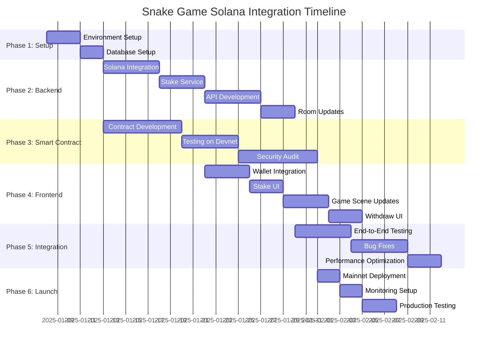

# Implementation Roadmap

## Overview

This document outlines the complete implementation plan for integrating Solana blockchain and stake-to-play mechanics into the Snake Game.

## Timeline Estimate

**Total Duration**: 8-12 weeks (depending on team size and blockchain experience)



---

## Phase 1: Environment & Database Setup (Week 1)

### 1.1 Development Environment

**Tasks:**
- [ ] Set up Solana CLI and wallet
- [ ] Install Anchor framework
- [ ] Configure development RPC endpoints
- [ ] Set up testing wallets with devnet SOL

**Files to Create:**
```
.env.development
.env.production
docs/setup-guide.md
```

**Commands:**
```bash
# Install Solana CLI
sh -c "$(curl -sSfL https://release.solana.com/stable/install)"

# Install Anchor
cargo install --git https://github.com/coral-xyz/anchor anchor-cli --locked

# Create test wallet
solana-keygen new --outfile ~/.config/solana/devnet.json

# Airdrop devnet SOL
solana airdrop 2 --url devnet
```

### 1.2 Database Setup

**Tasks:**
- [ ] Install PostgreSQL
- [ ] Create database schema
- [ ] Set up migrations
- [ ] Create seed data for testing

**SQL Files to Create:**
```
server/migrations/
├── 001_create_players_table.sql
├── 002_create_transactions_table.sql
├── 003_create_game_sessions_table.sql
├── 004_create_kill_events_table.sql
├── 005_create_stake_pool_table.sql
└── 006_create_buyback_transactions_table.sql
```

**Implementation:**
```bash
cd server
pnpm add pg typeorm
pnpm add -D @types/pg

# Create database
createdb snake_game_dev

# Run migrations
npm run migration:run
```

### 1.3 Dependencies Installation

**Server:**
```bash
cd server
pnpm add @solana/web3.js @solana/spl-token
pnpm add pg typeorm redis bull
pnpm add express cors helmet
pnpm add jsonwebtoken bcrypt
pnpm add dotenv
pnpm add -D @types/node @types/express @types/jsonwebtoken
```

**UI:**
```bash
cd ui
pnpm add @solana/wallet-adapter-react @solana/wallet-adapter-react-ui
pnpm add @solana/wallet-adapter-wallets @solana/wallet-adapter-base
pnpm add @solana/web3.js
pnpm add axios
```

---

## Phase 2: Backend Development (Weeks 2-3)

### 2.1 Solana Integration Service

**Priority**: HIGH  
**Duration**: 5 days

**Tasks:**
- [ ] Create `SolanaService.ts`
- [ ] Implement transaction verification
- [ ] Implement SOL transfer functions
- [ ] Add balance checking
- [ ] Add error handling

**Files:**
```
server/src/services/
├── SolanaService.ts
├── WalletService.ts
└── TransactionService.ts
```

**Testing:**
- Unit tests for each method
- Integration tests with devnet
- Mock tests for CI/CD

### 2.2 Stake Service

**Priority**: HIGH  
**Duration**: 4 days

**Tasks:**
- [ ] Create `StakeService.ts`
- [ ] Implement stake deposit logic
- [ ] Implement withdraw calculation
- [ ] Implement withdraw processing
- [ ] Add snake size calculation
- [ ] Integrate with database

**Files:**
```
server/src/services/StakeService.ts
server/src/repositories/
├── PlayerRepository.ts
├── TransactionRepository.ts
└── StakePoolRepository.ts
```

### 2.3 API Development

**Priority**: HIGH  
**Duration**: 5 days

**Tasks:**
- [ ] Set up Express routes
- [ ] Implement wallet endpoints
- [ ] Implement stake endpoints
- [ ] Implement withdraw endpoints
- [ ] Add authentication middleware
- [ ] Add rate limiting
- [ ] Add error handling

**Files:**
```
server/src/api/
├── routes/
│   ├── wallet.routes.ts
│   ├── stake.routes.ts
│   ├── withdraw.routes.ts
│   └── token.routes.ts
├── middlewares/
│   ├── auth.middleware.ts
│   ├── rateLimit.middleware.ts
│   └── errorHandler.middleware.ts
└── server.ts
```

**API Endpoints to Implement:**
```
POST   /api/wallet/request-verification
POST   /api/wallet/verify
GET    /api/wallet/balance/:address

POST   /api/stake/deposit
GET    /api/stake/calculate-size
GET    /api/stake/verify/:txHash

GET    /api/withdraw/calculate
POST   /api/withdraw/request
GET    /api/withdraw/status/:transactionId

GET    /api/token/stats
POST   /api/token/trigger-buyback
GET    /api/token/buyback-history

GET    /api/leaderboard/top-earners
```

### 2.4 Colyseus Room Updates

**Priority**: HIGH  
**Duration**: 3 days

**Tasks:**
- [ ] Update `SnakeGameState` schema
- [ ] Add wallet and stake fields to Player
- [ ] Update `onJoin` to verify stake
- [ ] Implement kill reward distribution
- [ ] Update collision detection
- [ ] Add session tracking

**Files:**
```
server/src/rooms/
├── SnakeGameRoom.ts (update)
└── schema/
    └── SnakeGameState.ts (update)
```

---

## Phase 3: Smart Contract Development (Weeks 2-4)

### 3.1 Anchor Program Development

**Priority**: HIGH  
**Duration**: 7 days

**Tasks:**
- [ ] Initialize Anchor project
- [ ] Define account structures
- [ ] Implement initialize instruction
- [ ] Implement stake instruction
- [ ] Implement withdraw instruction
- [ ] Implement process_kill instruction
- [ ] Implement buyback instruction
- [ ] Implement burn instruction
- [ ] Add admin functions
- [ ] Add error handling

**Project Structure:**
```bash
anchor init snake-game-program
cd snake-game-program
```

**Files:**
```
snake-game-program/
├── Anchor.toml
├── Cargo.toml
├── programs/
│   └── snake-game/
│       ├── Cargo.toml
│       └── src/
│           ├── lib.rs
│           ├── state/
│           │   ├── mod.rs
│           │   ├── stake_pool.rs
│           │   └── player_account.rs
│           ├── instructions/
│           │   ├── mod.rs
│           │   ├── initialize.rs
│           │   ├── stake.rs
│           │   ├── withdraw.rs
│           │   ├── process_kill.rs
│           │   ├── execute_buyback.rs
│           │   └── burn_tokens.rs
│           └── errors.rs
└── tests/
    ├── initialize.ts
    ├── stake.ts
    ├── withdraw.ts
    └── kill.ts
```

### 3.2 Testing on Devnet

**Priority**: HIGH  
**Duration**: 5 days

**Tasks:**
- [ ] Write unit tests for each instruction
- [ ] Write integration tests
- [ ] Test on localnet
- [ ] Deploy to devnet
- [ ] Test all flows on devnet
- [ ] Load testing
- [ ] Edge case testing

**Test Scenarios:**
```
✓ Initialize stake pool
✓ Player stakes minimum amount
✓ Player stakes maximum amount
✓ Player stakes below minimum (should fail)
✓ Player stakes above maximum (should fail)
✓ Player withdraws with no kills (10% fee)
✓ Player withdraws with kills (no fee)
✓ Player kills another player (90/10 split)
✓ Simultaneous kills
✓ Buyback threshold reached
✓ Emergency pause
✓ Admin operations
```

### 3.3 Security Audit

**Priority**: CRITICAL  
**Duration**: 7 days

**Tasks:**
- [ ] Internal code review
- [ ] Automated security scanning
- [ ] Third-party audit (recommended)
- [ ] Fix identified issues
- [ ] Re-test after fixes

**Security Checklist:**
- [ ] No reentrancy vulnerabilities
- [ ] Proper access controls
- [ ] Overflow/underflow protection
- [ ] PDA seed validation
- [ ] Signer validation
- [ ] Account ownership checks
- [ ] Emergency pause mechanism
- [ ] Proper error handling

---

## Phase 4: Frontend Development (Weeks 3-4)

### 4.1 Wallet Integration

**Priority**: HIGH  
**Duration**: 4 days

**Tasks:**
- [ ] Set up wallet adapter
- [ ] Create `WalletProvider` component
- [ ] Create `WalletConnectButton` component
- [ ] Implement wallet verification
- [ ] Create `WalletConnectScene`
- [ ] Add wallet balance display
- [ ] Add connection state management

**Files:**
```
ui/src/components/wallet/
├── WalletProvider.tsx
├── WalletConnectButton.tsx
└── WalletBalance.tsx

ui/src/services/
├── WalletService.ts
└── SolanaService.ts

ui/src/game/scenes/
└── WalletConnectScene.ts
```

### 4.2 Stake UI

**Priority**: HIGH  
**Duration**: 3 days

**Tasks:**
- [ ] Create `StakeScene`
- [ ] Create `StakeModal` component
- [ ] Implement stake amount input
- [ ] Show snake size preview
- [ ] Implement transaction submission
- [ ] Add loading states
- [ ] Add error handling
- [ ] Add transaction confirmation

**Files:**
```
ui/src/components/stake/
├── StakeModal.tsx
└── StakeDisplay.tsx

ui/src/game/scenes/
└── StakeScene.ts

ui/src/services/
└── StakeService.ts
```

### 4.3 Game Scene Updates

**Priority**: HIGH  
**Duration**: 4 days

**Tasks:**
- [ ] Update `GameScene` to show stake
- [ ] Add HUD with stake/earnings display
- [ ] Implement kill notifications
- [ ] Add leaderboard overlay
- [ ] Update player spawn with stake-based size
- [ ] Add visual effects for kills
- [ ] Update camera for larger snakes

**Files:**
```
ui/src/components/game/
├── GameHUD.tsx
├── KillNotification.tsx
└── Leaderboard.tsx

ui/src/game/scenes/
└── GameScene.ts (update)
```

### 4.4 Withdraw UI

**Priority**: HIGH  
**Duration**: 3 days

**Tasks:**
- [ ] Create `WithdrawModal` component
- [ ] Implement withdraw calculation display
- [ ] Show fee warning
- [ ] Implement withdraw confirmation
- [ ] Add transaction status tracking
- [ ] Create game summary screen

**Files:**
```
ui/src/components/withdraw/
└── WithdrawModal.tsx

ui/src/components/game/
└── GameSummary.tsx
```

---

## Phase 5: Integration & Testing (Weeks 5-6)

### 5.1 End-to-End Testing

**Priority**: CRITICAL  
**Duration**: 5 days

**Tasks:**
- [ ] Test complete user flow
- [ ] Test wallet connection
- [ ] Test stake & join
- [ ] Test gameplay with real stakes
- [ ] Test kill & reward distribution
- [ ] Test withdraw with/without fee
- [ ] Test edge cases
- [ ] Cross-browser testing
- [ ] Mobile testing

**Test Flows:**
```
Flow 1: Complete Game Cycle
1. Connect wallet
2. Stake 0.5 SOL
3. Join game
4. Kill another player
5. Withdraw (no fee)
6. Verify balance

Flow 2: Death & Respawn
1. Stake 0.3 SOL
2. Join game
3. Get killed
4. Respawn
5. Stake again
6. Continue playing

Flow 3: Withdraw with Fee
1. Stake 0.2 SOL
2. Join game
3. Play without killing
4. Withdraw (10% fee)
5. Verify fee applied

Flow 4: Multiple Players
1. 5 players join
2. Various stakes (0.1 - 2.0 SOL)
3. Play for 10 minutes
4. Track all kills and rewards
5. Verify all balances correct
```

### 5.2 Bug Fixes

**Priority**: HIGH  
**Duration**: 5 days

**Tasks:**
- [ ] Fix identified bugs from testing
- [ ] Optimize performance issues
- [ ] Fix UI/UX issues
- [ ] Handle edge cases
- [ ] Improve error messages
- [ ] Add logging

### 5.3 Performance Optimization

**Priority**: MEDIUM  
**Duration**: 3 days

**Tasks:**
- [ ] Optimize database queries
- [ ] Add Redis caching
- [ ] Optimize Phaser rendering
- [ ] Reduce network calls
- [ ] Optimize blockchain queries
- [ ] Add connection pooling
- [ ] Profile and optimize bottlenecks

---

## Phase 6: Deployment & Launch (Weeks 7-8)

### 6.1 Mainnet Deployment

**Priority**: CRITICAL  
**Duration**: 2 days

**Tasks:**
- [ ] Deploy smart contract to mainnet
- [ ] Initialize stake pool on mainnet
- [ ] Create project token (if needed)
- [ ] Set up production RPC endpoints
- [ ] Deploy backend to production server
- [ ] Deploy frontend to CDN
- [ ] Configure domain and SSL
- [ ] Set up database backups

**Deployment Checklist:**
- [ ] Environment variables configured
- [ ] Database migrated
- [ ] Smart contract verified
- [ ] Admin wallet secured (multisig)
- [ ] Monitoring set up
- [ ] Logs configured
- [ ] Backups automated
- [ ] Emergency procedures documented

### 6.2 Monitoring Setup

**Priority**: HIGH  
**Duration**: 2 days

**Tasks:**
- [ ] Set up server monitoring
- [ ] Set up blockchain monitoring
- [ ] Set up error tracking (Sentry)
- [ ] Set up analytics
- [ ] Configure alerts
- [ ] Create monitoring dashboard
- [ ] Set up uptime monitoring

**Metrics to Monitor:**
```
Server:
- CPU/Memory usage
- API response times
- Error rates
- Active connections

Blockchain:
- Transaction success rate
- Gas/fee costs
- Stake pool balance
- Pending buyback amount
- Total burned tokens

Game:
- Active players
- Average stake amount
- Kill rate
- Withdraw rate
- Session duration
```

### 6.3 Production Testing

**Priority**: CRITICAL  
**Duration**: 3 days

**Tasks:**
- [ ] Soft launch with limited users
- [ ] Monitor all metrics
- [ ] Test with real SOL (small amounts)
- [ ] Verify all transactions
- [ ] Test emergency pause
- [ ] Load testing
- [ ] Final security check

**Launch Plan:**
1. **Day 1**: Internal testing (team members)
2. **Day 2**: Beta testing (selected users)
3. **Day 3**: Public launch

---

## Post-Launch Tasks

### Week 9+

**Immediate (Week 9):**
- [ ] Monitor 24/7 for first week
- [ ] Fix critical bugs immediately
- [ ] Collect user feedback
- [ ] Optimize based on real usage
- [ ] Marketing & promotion

**Short-term (Weeks 10-12):**
- [ ] Add additional features (leaderboard rewards, tournaments)
- [ ] Optimize game balance based on data
- [ ] Improve UI/UX based on feedback
- [ ] Add social features
- [ ] Mobile app (optional)

**Long-term (Months 4-6):**
- [ ] Add new game modes
- [ ] NFT integration (snake skins)
- [ ] Governance token features
- [ ] Cross-platform support
- [ ] Community events

---

## Risk Mitigation

### Technical Risks

| Risk | Impact | Probability | Mitigation |
|------|--------|-------------|------------|
| Smart contract vulnerability | Critical | Low | Thorough audit, testing, emergency pause |
| Blockchain network issues | High | Medium | Backup RPC, retry logic, graceful degradation |
| High gas fees | Medium | Medium | Optimize transactions, batch operations |
| Database performance | Medium | Low | Proper indexing, caching, scaling plan |
| DDoS attacks | High | Medium | Rate limiting, CDN, firewall |

### Business Risks

| Risk | Impact | Probability | Mitigation |
|------|--------|-------------|------------|
| Low user adoption | High | Medium | Marketing, fair tokenomics, fun gameplay |
| Regulatory issues | Critical | Low | Legal consultation, KYC if needed |
| Token price volatility | Medium | High | Clear buyback mechanism, stable rewards |
| Competitors | Medium | High | Unique features, community building |

---

## Team Roles & Responsibilities

### Recommended Team Structure

**Blockchain Developer** (1-2 people)
- Smart contract development
- Solana integration
- Security testing

**Backend Developer** (1-2 people)
- API development
- Database design
- Server infrastructure

**Frontend Developer** (1-2 people)
- UI/UX implementation
- Wallet integration
- Game scene updates

**Full-stack/DevOps** (1 person)
- Deployment
- Monitoring
- CI/CD pipeline

**Game Designer** (1 person)
- Balance tuning
- Tokenomics design
- User experience

---

## Success Metrics

### Launch Goals (Week 1)

- [ ] 100+ active wallets connected
- [ ] 50+ concurrent players
- [ ] 10+ SOL total staked
- [ ] 0 critical bugs
- [ ] <100ms average latency

### Month 1 Goals

- [ ] 1,000+ registered players
- [ ] 100+ daily active users
- [ ] 100+ SOL total staked
- [ ] 10,000+ games played
- [ ] Token buyback > 10 SOL

### Month 3 Goals

- [ ] 10,000+ registered players
- [ ] 500+ daily active users
- [ ] 1,000+ SOL total staked
- [ ] 100,000+ games played
- [ ] Profitable token buyback mechanism

---

## Development Best Practices

### Code Standards
- Use TypeScript for type safety
- Follow ESLint rules
- Write unit tests (>80% coverage)
- Document complex logic
- Use meaningful variable names
- Git commit conventions

### Security
- Never commit private keys
- Use environment variables
- Validate all user inputs
- Use parameterized queries
- Implement rate limiting
- Regular security audits

### Testing
- Unit tests for all services
- Integration tests for API
- E2E tests for critical flows
- Load testing before launch
- Security testing
- Manual QA testing

---

## Resources & Documentation

### Official Docs
- [Solana Docs](https://docs.solana.com)
- [Anchor Book](https://book.anchor-lang.com)
- [Colyseus Docs](https://docs.colyseus.io)
- [Phaser Docs](https://photonstorm.github.io/phaser3-docs)

### Community
- Solana Discord
- Anchor Discord
- Stack Overflow
- GitHub Issues

---

**Document Version**: 1.0  
**Last Updated**: 2025-01-07  
**Next Review**: Before Phase 1 kickoff

