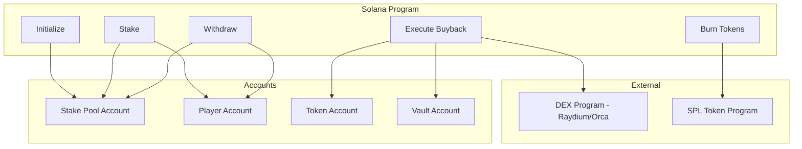

# Smart Contract Design - Solana Program

## 1. Overview

This document outlines the design of the Solana program (smart contract) for managing stake pool, token buyback, and burn mechanisms for the Snake Game.

## 2. Program Architecture



## 3. Account Structures

### 3.1 Stake Pool Account

**Purpose**: Stores global state of the stake pool

```rust
// lib.rs

use anchor_lang::prelude::*;

#[account]
pub struct StakePool {
    /// Authority that can execute admin operations
    pub authority: Pubkey,
    
    /// Bump seed for PDA
    pub bump: u8,
    
    /// Total SOL staked across all players
    pub total_staked: u64,
    
    /// Total SOL withdrawn
    pub total_withdrawn: u64,
    
    /// SOL pending for buyback
    pub pending_buyback: u64,
    
    /// Total SOL used for buyback
    pub total_bought_back: u64,
    
    /// Total tokens burned
    pub total_burned: u64,
    
    /// Project token mint address
    pub token_mint: Pubkey,
    
    /// Vault account (holds SOL for buyback)
    pub vault: Pubkey,
    
    /// Minimum stake amount (in lamports)
    pub min_stake: u64,
    
    /// Maximum stake amount (in lamports)
    pub max_stake: u64,
    
    /// Withdraw fee percentage (in basis points, 1000 = 10%)
    pub withdraw_fee_bps: u16,
    
    /// Kill reward percentage (in basis points, 9000 = 90%)
    pub kill_reward_bps: u16,
    
    /// Buyback percentage (in basis points, 1000 = 10%)
    pub buyback_bps: u16,
    
    /// Buyback threshold (minimum SOL to trigger buyback)
    pub buyback_threshold: u64,
    
    /// Paused state (emergency pause)
    pub paused: bool,
}

impl StakePool {
    pub const LEN: usize = 8 + // discriminator
        32 + // authority
        1 +  // bump
        8 +  // total_staked
        8 +  // total_withdrawn
        8 +  // pending_buyback
        8 +  // total_bought_back
        8 +  // total_burned
        32 + // token_mint
        32 + // vault
        8 +  // min_stake
        8 +  // max_stake
        2 +  // withdraw_fee_bps
        2 +  // kill_reward_bps
        2 +  // buyback_bps
        8 +  // buyback_threshold
        1;   // paused
}
```

### 3.2 Player Account

**Purpose**: Stores individual player stake information

```rust
#[account]
pub struct PlayerAccount {
    /// Player's wallet address
    pub wallet: Pubkey,
    
    /// Bump seed for PDA
    pub bump: u8,
    
    /// Current staked amount (in lamports)
    pub current_stake: u64,
    
    /// Total amount ever staked
    pub total_staked: u64,
    
    /// Total amount earned from kills
    pub total_earned: u64,
    
    /// Total kills
    pub total_kills: u32,
    
    /// Whether player has killed someone in current session
    pub has_killed_current_session: bool,
    
    /// Last stake timestamp
    pub last_stake_time: i64,
    
    /// Last withdraw timestamp
    pub last_withdraw_time: i64,
}

impl PlayerAccount {
    pub const LEN: usize = 8 + // discriminator
        32 + // wallet
        1 +  // bump
        8 +  // current_stake
        8 +  // total_staked
        8 +  // total_earned
        4 +  // total_kills
        1 +  // has_killed_current_session
        8 +  // last_stake_time
        8;   // last_withdraw_time
}
```

## 4. Instructions

### 4.1 Initialize

**Purpose**: Initialize the stake pool (one-time setup)

```rust
#[derive(Accounts)]
pub struct Initialize<'info> {
    #[account(
        init,
        payer = authority,
        space = StakePool::LEN,
        seeds = [b"stake_pool"],
        bump
    )]
    pub stake_pool: Account<'info, StakePool>,
    
    #[account(mut)]
    pub authority: Signer<'info>,
    
    /// Token mint for the project token
    pub token_mint: Account<'info, Mint>,
    
    /// Vault account (PDA) to hold SOL for buyback
    /// CHECK: This is safe because we're just creating a PDA
    #[account(
        seeds = [b"vault"],
        bump
    )]
    pub vault: AccountInfo<'info>,
    
    pub system_program: Program<'info, System>,
    pub rent: Sysvar<'info, Rent>,
}

pub fn initialize(
    ctx: Context<Initialize>,
    min_stake: u64,
    max_stake: u64,
    withdraw_fee_bps: u16,
    kill_reward_bps: u16,
    buyback_bps: u16,
    buyback_threshold: u64,
) -> Result<()> {
    let stake_pool = &mut ctx.accounts.stake_pool;
    
    stake_pool.authority = ctx.accounts.authority.key();
    stake_pool.bump = *ctx.bumps.get("stake_pool").unwrap();
    stake_pool.token_mint = ctx.accounts.token_mint.key();
    stake_pool.vault = ctx.accounts.vault.key();
    stake_pool.min_stake = min_stake;
    stake_pool.max_stake = max_stake;
    stake_pool.withdraw_fee_bps = withdraw_fee_bps;
    stake_pool.kill_reward_bps = kill_reward_bps;
    stake_pool.buyback_bps = buyback_bps;
    stake_pool.buyback_threshold = buyback_threshold;
    stake_pool.paused = false;
    
    stake_pool.total_staked = 0;
    stake_pool.total_withdrawn = 0;
    stake_pool.pending_buyback = 0;
    stake_pool.total_bought_back = 0;
    stake_pool.total_burned = 0;
    
    msg!("Stake pool initialized");
    Ok(())
}
```

### 4.2 Stake

**Purpose**: Player stakes SOL to join the game

```rust
#[derive(Accounts)]
pub struct Stake<'info> {
    #[account(
        mut,
        seeds = [b"stake_pool"],
        bump = stake_pool.bump
    )]
    pub stake_pool: Account<'info, StakePool>,
    
    #[account(
        init_if_needed,
        payer = player,
        space = PlayerAccount::LEN,
        seeds = [b"player", player.key().as_ref()],
        bump
    )]
    pub player_account: Account<'info, PlayerAccount>,
    
    #[account(mut)]
    pub player: Signer<'info>,
    
    /// Vault to receive staked SOL
    /// CHECK: This is safe - we're transferring to our PDA vault
    #[account(
        mut,
        seeds = [b"vault"],
        bump
    )]
    pub vault: AccountInfo<'info>,
    
    pub system_program: Program<'info, System>,
}

pub fn stake(ctx: Context<Stake>, amount: u64) -> Result<()> {
    let stake_pool = &mut ctx.accounts.stake_pool;
    let player_account = &mut ctx.accounts.player_account;
    
    // Check if paused
    require!(!stake_pool.paused, ErrorCode::PoolPaused);
    
    // Validate amount
    require!(
        amount >= stake_pool.min_stake,
        ErrorCode::StakeTooLow
    );
    require!(
        amount <= stake_pool.max_stake,
        ErrorCode::StakeTooHigh
    );
    
    // Initialize player account if needed
    if player_account.wallet == Pubkey::default() {
        player_account.wallet = ctx.accounts.player.key();
        player_account.bump = *ctx.bumps.get("player_account").unwrap();
        player_account.current_stake = 0;
        player_account.total_staked = 0;
        player_account.total_earned = 0;
        player_account.total_kills = 0;
        player_account.has_killed_current_session = false;
    }
    
    // Transfer SOL to vault
    let transfer_instruction = anchor_lang::solana_program::system_instruction::transfer(
        &ctx.accounts.player.key(),
        &ctx.accounts.vault.key(),
        amount,
    );
    
    anchor_lang::solana_program::program::invoke(
        &transfer_instruction,
        &[
            ctx.accounts.player.to_account_info(),
            ctx.accounts.vault.to_account_info(),
        ],
    )?;
    
    // Update player account
    player_account.current_stake = player_account.current_stake.checked_add(amount)
        .ok_or(ErrorCode::Overflow)?;
    player_account.total_staked = player_account.total_staked.checked_add(amount)
        .ok_or(ErrorCode::Overflow)?;
    player_account.has_killed_current_session = false;
    player_account.last_stake_time = Clock::get()?.unix_timestamp;
    
    // Update pool stats
    stake_pool.total_staked = stake_pool.total_staked.checked_add(amount)
        .ok_or(ErrorCode::Overflow)?;
    
    msg!("Player {} staked {} lamports", ctx.accounts.player.key(), amount);
    Ok(())
}
```

### 4.3 Withdraw

**Purpose**: Player withdraws their stake (with optional fee)

```rust
#[derive(Accounts)]
pub struct Withdraw<'info> {
    #[account(
        mut,
        seeds = [b"stake_pool"],
        bump = stake_pool.bump
    )]
    pub stake_pool: Account<'info, StakePool>,
    
    #[account(
        mut,
        seeds = [b"player", player.key().as_ref()],
        bump = player_account.bump,
        has_one = wallet @ ErrorCode::UnauthorizedPlayer
    )]
    pub player_account: Account<'info, PlayerAccount>,
    
    #[account(mut)]
    pub player: Signer<'info>,
    
    /// Vault holding staked SOL
    /// CHECK: This is safe - we're transferring from our PDA vault
    #[account(
        mut,
        seeds = [b"vault"],
        bump
    )]
    pub vault: AccountInfo<'info>,
    
    pub system_program: Program<'info, System>,
}

pub fn withdraw(ctx: Context<Withdraw>) -> Result<()> {
    let stake_pool = &mut ctx.accounts.stake_pool;
    let player_account = &mut ctx.accounts.player_account;
    
    // Check if paused
    require!(!stake_pool.paused, ErrorCode::PoolPaused);
    
    // Check if player has stake
    require!(
        player_account.current_stake > 0,
        ErrorCode::NoStakeToWithdraw
    );
    
    let stake_amount = player_account.current_stake;
    
    // Calculate fee
    let fee_amount = if !player_account.has_killed_current_session {
        // Apply 10% fee if no kills
        (stake_amount as u128)
            .checked_mul(stake_pool.withdraw_fee_bps as u128)
            .and_then(|v| v.checked_div(10000))
            .and_then(|v| u64::try_from(v).ok())
            .ok_or(ErrorCode::Overflow)?
    } else {
        0
    };
    
    let withdraw_amount = stake_amount.checked_sub(fee_amount)
        .ok_or(ErrorCode::Underflow)?;
    
    // Transfer SOL to player
    let vault_bump = *ctx.bumps.get("vault").unwrap();
    let seeds = &[b"vault".as_ref(), &[vault_bump]];
    let signer_seeds = &[&seeds[..]];
    
    **ctx.accounts.vault.to_account_info().try_borrow_mut_lamports()? -= withdraw_amount;
    **ctx.accounts.player.to_account_info().try_borrow_mut_lamports()? += withdraw_amount;
    
    // Add fee to pending buyback
    if fee_amount > 0 {
        stake_pool.pending_buyback = stake_pool.pending_buyback.checked_add(fee_amount)
            .ok_or(ErrorCode::Overflow)?;
    }
    
    // Update player account
    player_account.current_stake = 0;
    player_account.has_killed_current_session = false;
    player_account.last_withdraw_time = Clock::get()?.unix_timestamp;
    
    // Update pool stats
    stake_pool.total_withdrawn = stake_pool.total_withdrawn.checked_add(withdraw_amount)
        .ok_or(ErrorCode::Overflow)?;
    
    msg!(
        "Player {} withdrew {} lamports (fee: {} lamports)",
        ctx.accounts.player.key(),
        withdraw_amount,
        fee_amount
    );
    
    Ok(())
}
```

### 4.4 Process Kill Reward

**Purpose**: Transfer reward from victim to killer when a kill occurs

```rust
#[derive(Accounts)]
pub struct ProcessKill<'info> {
    #[account(
        mut,
        seeds = [b"stake_pool"],
        bump = stake_pool.bump
    )]
    pub stake_pool: Account<'info, StakePool>,
    
    #[account(
        mut,
        seeds = [b"player", killer.key().as_ref()],
        bump = killer_account.bump
    )]
    pub killer_account: Account<'info, PlayerAccount>,
    
    #[account(
        mut,
        seeds = [b"player", victim.key().as_ref()],
        bump = victim_account.bump
    )]
    pub victim_account: Account<'info, PlayerAccount>,
    
    /// CHECK: Killer wallet (not signer - called by authority)
    pub killer: AccountInfo<'info>,
    
    /// CHECK: Victim wallet (not signer)
    pub victim: AccountInfo<'info>,
    
    /// Game server authority that can process kills
    pub authority: Signer<'info>,
    
    pub system_program: Program<'info, System>,
}

pub fn process_kill(ctx: Context<ProcessKill>) -> Result<()> {
    let stake_pool = &mut ctx.accounts.stake_pool;
    let killer_account = &mut ctx.accounts.killer_account;
    let victim_account = &mut ctx.accounts.victim_account;
    
    // Verify authority
    require!(
        ctx.accounts.authority.key() == stake_pool.authority,
        ErrorCode::UnauthorizedAuthority
    );
    
    // Check if paused
    require!(!stake_pool.paused, ErrorCode::PoolPaused);
    
    let victim_stake = victim_account.current_stake;
    
    // Calculate reward split
    let reward_amount = (victim_stake as u128)
        .checked_mul(stake_pool.kill_reward_bps as u128)
        .and_then(|v| v.checked_div(10000))
        .and_then(|v| u64::try_from(v).ok())
        .ok_or(ErrorCode::Overflow)?;
    
    let buyback_amount = victim_stake.checked_sub(reward_amount)
        .ok_or(ErrorCode::Underflow)?;
    
    // Update killer
    killer_account.current_stake = killer_account.current_stake.checked_add(reward_amount)
        .ok_or(ErrorCode::Overflow)?;
    killer_account.total_earned = killer_account.total_earned.checked_add(reward_amount)
        .ok_or(ErrorCode::Overflow)?;
    killer_account.total_kills = killer_account.total_kills.checked_add(1)
        .ok_or(ErrorCode::Overflow)?;
    killer_account.has_killed_current_session = true;
    
    // Update victim
    victim_account.current_stake = 0;
    
    // Add to buyback pool
    stake_pool.pending_buyback = stake_pool.pending_buyback.checked_add(buyback_amount)
        .ok_or(ErrorCode::Overflow)?;
    
    msg!(
        "Kill processed: {} killed {} | Reward: {} | Buyback: {}",
        ctx.accounts.killer.key(),
        ctx.accounts.victim.key(),
        reward_amount,
        buyback_amount
    );
    
    Ok(())
}
```

### 4.5 Execute Buyback

**Purpose**: Swap SOL for project tokens and burn them

```rust
use anchor_spl::token::{self, Token, TokenAccount, Mint, Burn};

#[derive(Accounts)]
pub struct ExecuteBuyback<'info> {
    #[account(
        mut,
        seeds = [b"stake_pool"],
        bump = stake_pool.bump
    )]
    pub stake_pool: Account<'info, StakePool>,
    
    #[account(mut)]
    pub authority: Signer<'info>,
    
    /// Vault holding SOL for buyback
    /// CHECK: This is safe - PDA vault
    #[account(
        mut,
        seeds = [b"vault"],
        bump
    )]
    pub vault: AccountInfo<'info>,
    
    /// Token account to receive bought tokens
    #[account(
        mut,
        associated_token::mint = token_mint,
        associated_token::authority = authority
    )]
    pub token_account: Account<'info, TokenAccount>,
    
    #[account(
        mut,
        address = stake_pool.token_mint
    )]
    pub token_mint: Account<'info, Mint>,
    
    // DEX accounts would go here (Raydium/Orca specific)
    // For simplicity, this is a placeholder
    /// CHECK: DEX program
    pub dex_program: AccountInfo<'info>,
    
    pub token_program: Program<'info, Token>,
    pub system_program: Program<'info, System>,
}

pub fn execute_buyback(ctx: Context<ExecuteBuyback>) -> Result<()> {
    let stake_pool = &mut ctx.accounts.stake_pool;
    
    // Verify authority
    require!(
        ctx.accounts.authority.key() == stake_pool.authority,
        ErrorCode::UnauthorizedAuthority
    );
    
    let pending = stake_pool.pending_buyback;
    
    // Check if threshold is met
    require!(
        pending >= stake_pool.buyback_threshold,
        ErrorCode::BuybackThresholdNotMet
    );
    
    msg!("Executing buyback for {} lamports", pending);
    
    // TODO: Integrate with actual DEX (Raydium/Orca/Jupiter)
    // This would involve:
    // 1. Transfer SOL from vault to DEX
    // 2. Execute swap via DEX program
    // 3. Receive tokens in token_account
    // 4. Burn received tokens
    
    // For now, we'll track the amounts
    stake_pool.total_bought_back = stake_pool.total_bought_back.checked_add(pending)
        .ok_or(ErrorCode::Overflow)?;
    stake_pool.pending_buyback = 0;
    
    msg!("Buyback executed successfully");
    Ok(())
}
```

### 4.6 Burn Tokens

**Purpose**: Burn project tokens after buyback

```rust
#[derive(Accounts)]
pub struct BurnTokens<'info> {
    #[account(
        mut,
        seeds = [b"stake_pool"],
        bump = stake_pool.bump
    )]
    pub stake_pool: Account<'info, StakePool>,
    
    #[account(mut)]
    pub authority: Signer<'info>,
    
    #[account(
        mut,
        associated_token::mint = token_mint,
        associated_token::authority = authority
    )]
    pub token_account: Account<'info, TokenAccount>,
    
    #[account(
        mut,
        address = stake_pool.token_mint
    )]
    pub token_mint: Account<'info, Mint>,
    
    pub token_program: Program<'info, Token>,
}

pub fn burn_tokens(ctx: Context<BurnTokens>, amount: u64) -> Result<()> {
    let stake_pool = &mut ctx.accounts.stake_pool;
    
    // Verify authority
    require!(
        ctx.accounts.authority.key() == stake_pool.authority,
        ErrorCode::UnauthorizedAuthority
    );
    
    // Burn tokens
    let cpi_accounts = Burn {
        mint: ctx.accounts.token_mint.to_account_info(),
        from: ctx.accounts.token_account.to_account_info(),
        authority: ctx.accounts.authority.to_account_info(),
    };
    
    let cpi_program = ctx.accounts.token_program.to_account_info();
    let cpi_ctx = CpiContext::new(cpi_program, cpi_accounts);
    
    token::burn(cpi_ctx, amount)?;
    
    // Update stats
    stake_pool.total_burned = stake_pool.total_burned.checked_add(amount)
        .ok_or(ErrorCode::Overflow)?;
    
    msg!("Burned {} tokens", amount);
    Ok(())
}
```

### 4.7 Admin Functions

```rust
#[derive(Accounts)]
pub struct UpdateConfig<'info> {
    #[account(
        mut,
        seeds = [b"stake_pool"],
        bump = stake_pool.bump,
        has_one = authority @ ErrorCode::UnauthorizedAuthority
    )]
    pub stake_pool: Account<'info, StakePool>,
    
    pub authority: Signer<'info>,
}

pub fn update_config(
    ctx: Context<UpdateConfig>,
    min_stake: Option<u64>,
    max_stake: Option<u64>,
    withdraw_fee_bps: Option<u16>,
    buyback_threshold: Option<u64>,
) -> Result<()> {
    let stake_pool = &mut ctx.accounts.stake_pool;
    
    if let Some(min) = min_stake {
        stake_pool.min_stake = min;
    }
    if let Some(max) = max_stake {
        stake_pool.max_stake = max;
    }
    if let Some(fee) = withdraw_fee_bps {
        require!(fee <= 2000, ErrorCode::FeeTooHigh); // Max 20%
        stake_pool.withdraw_fee_bps = fee;
    }
    if let Some(threshold) = buyback_threshold {
        stake_pool.buyback_threshold = threshold;
    }
    
    msg!("Config updated");
    Ok(())
}

pub fn toggle_pause(ctx: Context<UpdateConfig>) -> Result<()> {
    let stake_pool = &mut ctx.accounts.stake_pool;
    stake_pool.paused = !stake_pool.paused;
    
    msg!("Pool paused: {}", stake_pool.paused);
    Ok(())
}
```

## 5. Error Codes

```rust
#[error_code]
pub enum ErrorCode {
    #[msg("Pool is paused")]
    PoolPaused,
    
    #[msg("Stake amount is below minimum")]
    StakeTooLow,
    
    #[msg("Stake amount exceeds maximum")]
    StakeTooHigh,
    
    #[msg("No stake to withdraw")]
    NoStakeToWithdraw,
    
    #[msg("Unauthorized player")]
    UnauthorizedPlayer,
    
    #[msg("Unauthorized authority")]
    UnauthorizedAuthority,
    
    #[msg("Buyback threshold not met")]
    BuybackThresholdNotMet,
    
    #[msg("Fee too high")]
    FeeTooHigh,
    
    #[msg("Arithmetic overflow")]
    Overflow,
    
    #[msg("Arithmetic underflow")]
    Underflow,
}
```

## 6. Complete Program Structure

```
snake-game-program/
├── Anchor.toml
├── Cargo.toml
├── programs/
│   └── snake-game/
│       ├── Cargo.toml
│       └── src/
│           ├── lib.rs
│           ├── state/
│           │   ├── mod.rs
│           │   ├── stake_pool.rs
│           │   └── player_account.rs
│           ├── instructions/
│           │   ├── mod.rs
│           │   ├── initialize.rs
│           │   ├── stake.rs
│           │   ├── withdraw.rs
│           │   ├── process_kill.rs
│           │   ├── execute_buyback.rs
│           │   ├── burn_tokens.rs
│           │   └── admin.rs
│           └── errors.rs
├── tests/
│   ├── initialize.ts
│   ├── stake.ts
│   ├── withdraw.ts
│   ├── kill.ts
│   └── buyback.ts
└── migrations/
    └── deploy.ts
```

## 7. Deployment Configuration

### Anchor.toml

```toml
[features]
seeds = false
skip-lint = false

[programs.devnet]
snake_game = "YourProgramIDHere"

[programs.mainnet]
snake_game = "YourProgramIDHere"

[registry]
url = "https://api.apr.dev"

[provider]
cluster = "devnet"
wallet = "~/.config/solana/id.json"

[scripts]
test = "yarn run ts-mocha -p ./tsconfig.json -t 1000000 tests/**/*.ts"
```

## 8. Testing Strategy

### 8.1 Unit Tests

```typescript
// tests/stake.ts

import * as anchor from "@coral-xyz/anchor";
import { Program } from "@coral-xyz/anchor";
import { SnakeGame } from "../target/types/snake_game";
import { expect } from "chai";

describe("stake", () => {
  const provider = anchor.AnchorProvider.env();
  anchor.setProvider(provider);

  const program = anchor.workspace.SnakeGame as Program<SnakeGame>;

  it("Stakes SOL successfully", async () => {
    const stakeAmount = new anchor.BN(100_000_000); // 0.1 SOL
    
    const [stakePoolPda] = await anchor.web3.PublicKey.findProgramAddress(
      [Buffer.from("stake_pool")],
      program.programId
    );
    
    const [playerPda] = await anchor.web3.PublicKey.findProgramAddress(
      [Buffer.from("player"), provider.wallet.publicKey.toBuffer()],
      program.programId
    );
    
    const [vaultPda] = await anchor.web3.PublicKey.findProgramAddress(
      [Buffer.from("vault")],
      program.programId
    );
    
    await program.methods
      .stake(stakeAmount)
      .accounts({
        stakePool: stakePoolPda,
        playerAccount: playerPda,
        player: provider.wallet.publicKey,
        vault: vaultPda,
      })
      .rpc();
    
    const playerAccount = await program.account.playerAccount.fetch(playerPda);
    expect(playerAccount.currentStake.toNumber()).to.equal(stakeAmount.toNumber());
  });
  
  it("Rejects stake below minimum", async () => {
    const stakeAmount = new anchor.BN(10_000_000); // 0.01 SOL (below min)
    
    try {
      await program.methods
        .stake(stakeAmount)
        .accounts({
          // ... accounts
        })
        .rpc();
      
      expect.fail("Should have thrown error");
    } catch (err) {
      expect(err.toString()).to.include("StakeTooLow");
    }
  });
});
```

### 8.2 Integration Tests

```typescript
// tests/integration.ts

describe("Full game flow", () => {
  it("Complete stake -> kill -> withdraw flow", async () => {
    // 1. Player 1 stakes
    // 2. Player 2 stakes
    // 3. Player 1 kills Player 2
    // 4. Verify rewards distributed
    // 5. Verify buyback pool updated
    // 6. Player 1 withdraws with no fee
    // 7. Verify final balances
  });
});
```

## 9. Security Considerations

### 9.1 Access Control
- ✅ Only game server authority can process kills
- ✅ Only admin can execute buyback and update config
- ✅ Players can only withdraw their own stake
- ✅ Emergency pause mechanism

### 9.2 Reentrancy Protection
- ✅ Use Anchor's built-in protections
- ✅ Update state before transfers
- ✅ No external calls in critical sections

### 9.3 Overflow Protection
- ✅ Use checked arithmetic operations
- ✅ Validate all input amounts
- ✅ Proper error handling

### 9.4 PDA Security
- ✅ Proper seed derivation
- ✅ Validate all PDA accounts
- ✅ Use canonical bumps

## 10. Deployment Checklist

### Devnet
- [ ] Deploy program to devnet
- [ ] Initialize stake pool
- [ ] Create test token mint
- [ ] Test all instructions
- [ ] Test edge cases
- [ ] Load testing

### Mainnet
- [ ] Security audit completed
- [ ] Deploy program to mainnet
- [ ] Initialize stake pool with prod values
- [ ] Set up monitoring
- [ ] Set up admin multisig
- [ ] Emergency response plan ready

## 11. Monitoring & Maintenance

### Metrics to Monitor
- Total SOL staked
- Total SOL in vault
- Pending buyback amount
- Number of active players
- Kill events per hour
- Withdraw events and fees
- Program CU usage

### Alerts
- Vault balance low
- Buyback threshold reached
- Unusual withdrawal patterns
- Program errors

---

**Document Version**: 1.0  
**Last Updated**: 2025-01-07

